# UART Ethernet Modem 工作原理文档

本文档详细描述了 UART Ethernet Modem 驱动的工作原理，包括状态机转换、UART DMA 机制、低功耗管理等核心内容。

> 与 `components/uart-uhci` 协作：`UartEthModem` 负责帧协议、状态机、AT 命令；
> `UartUhci` 负责 UHCI + GDMA 的接收（缓冲区池 + owner 机制）以及 TX FIFO 同步发送。
> 两者通过回调和事件队列解耦。

## 目录

1. [系统架构概述](#1-系统架构概述)
2. [状态机详解](#2-状态机详解)
3. [UART DMA 机制](#3-uart-dma-机制)
4. [帧协议格式](#4-帧协议格式)
5. [事件处理机制](#5-事件处理机制)
6. [初始化流程](#6-初始化流程)
7. [数据流](#7-数据流)
8. [低功耗管理](#8-低功耗管理)
9. [帧重组机制](#9-帧重组机制)
10. [错误处理](#10-错误处理)
11. [关键配置参数](#11-关键配置参数)
12. [线程安全](#12-线程安全)
13. [性能优化](#13-性能优化)
14. [调试建议](#14-调试建议)

---

## 1. 系统架构概述

UART Ethernet Modem 驱动采用分层架构，通过 UHCI + GDMA 实现高效的接收，TX 端使用 UART FIFO 同步写入，并通过状态机管理低功耗模式。

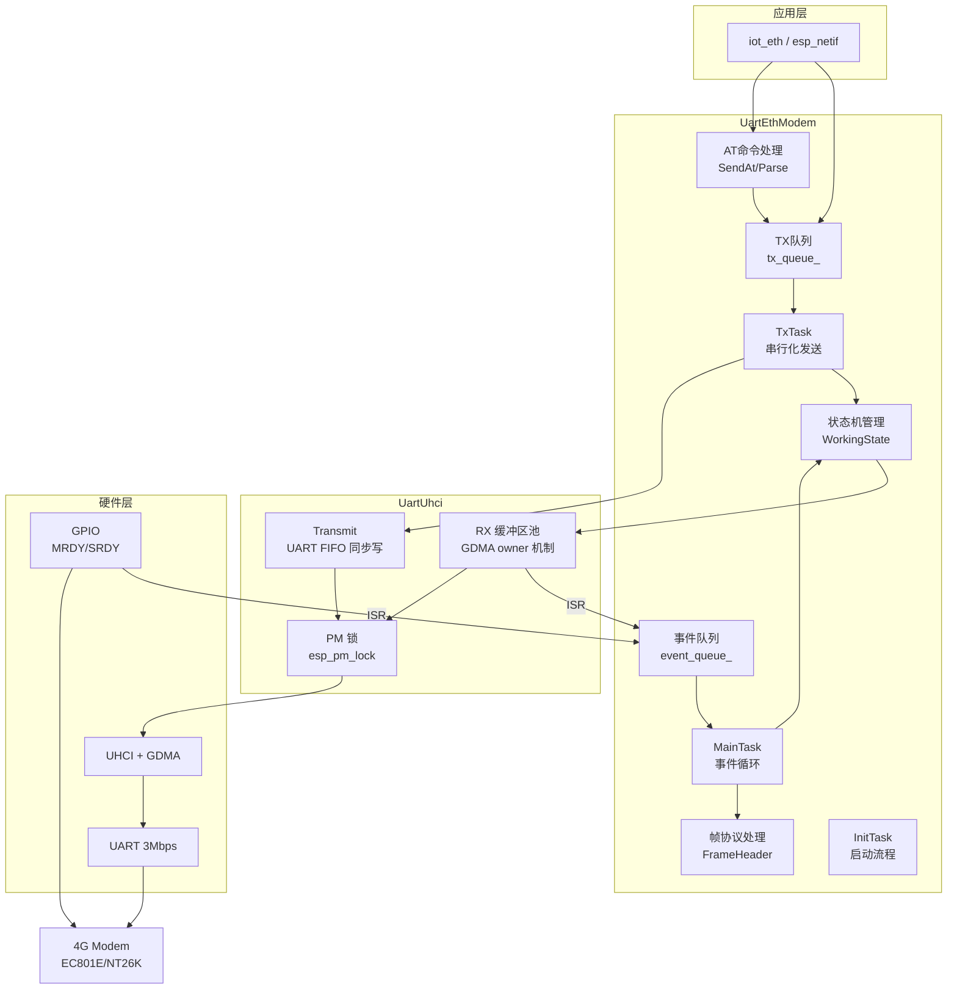
```mermaid
graph TB
    subgraph "应用层"
        APP[iot_eth / esp_netif]
    end

    subgraph "UartEthModem"
        SM[状态机管理<br/>WorkingState]
        FP[帧协议处理<br/>FrameHeader]
        AT[AT命令处理<br/>SendAt/Parse]
        EQ[事件队列<br/>event_queue_]
        TQ[TX队列<br/>tx_queue_]
        TT[TxTask<br/>串行化发送]
        MT[MainTask<br/>事件循环]
        IT[InitTask<br/>启动流程]
    end

    subgraph "UartUhci"
        TXFIFO[Transmit<br/>UART FIFO 同步写]
        RXPOOL[RX 缓冲区池<br/>GDMA owner 机制]
        PM[PM 锁<br/>esp_pm_lock]
    end

    subgraph "硬件层"
        UART[UART 3Mbps]
        GPIO[GPIO<br/>MRDY/SRDY]
        UHCI[UHCI + GDMA]
    end

    MODEM[4G Modem<br/>EC801E/NT26K]

    APP --> TQ
    APP --> AT
    AT --> TQ
    TQ --> TT
    TT --> SM
    TT --> TXFIFO
    MT --> SM
    MT --> FP
    SM --> RXPOOL
    EQ --> MT
    RXPOOL -- ISR --> EQ
    GPIO -- ISR --> EQ
    TXFIFO --> PM
    RXPOOL --> PM
    PM --> UHCI
    UHCI --> UART
    UART --> MODEM
    GPIO --> MODEM
```

### 核心组件

- **UartEthModem**：主驱动类，管理状态机、帧协议、AT 命令、初始化序列。
- **UartUhci**：UHCI + GDMA 控制器（独立组件 `components/uart-uhci`），提供：
  - 基于缓冲区池 + GDMA owner 的持续 RX；
  - 同步阻塞的 TX FIFO 写入（不占用 GDMA 通道）；
  - 接收期间的 PM 锁管理。
- **MainTask**：单一事件循环，处理来自 ISR 与其它任务的事件，驱动状态机。
- **InitTask**：异步执行 AT 启动序列、握手与 `iot_eth` 安装。
- **TxTask**：串行化所有帧发送（AT、握手、Ethernet），消除 LWIP 阻塞。
- **事件队列**（`event_queue_`，深度 32）：连接 ISR、TxTask 与 MainTask。
- **TX 队列**（`tx_queue_`，深度 `kTxQueueDepth=32`）：从 LWIP/AT 路径异步入队帧。

---

## 2. 状态机详解

### 2.1 WorkingState 状态机

状态机用于管理低功耗模式，控制 RX DMA 的启停和 MRDY/SRDY 信号。

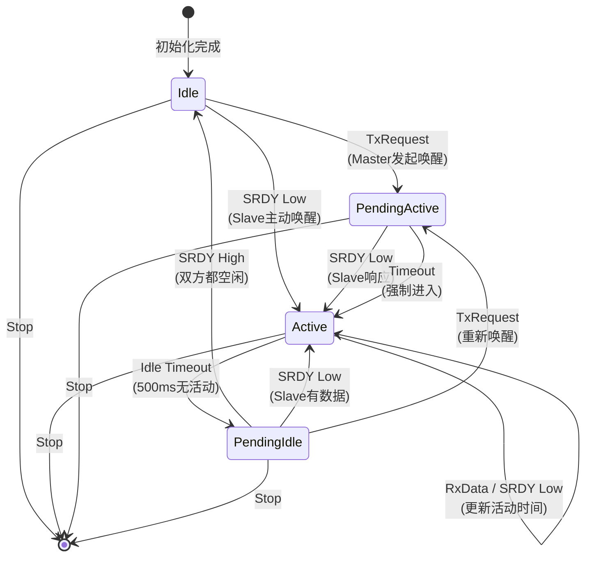
```mermaid
stateDiagram-v2
    [*] --> Idle: 初始化完成

    Idle --> PendingActive: TxRequest<br/>(Master发起唤醒)
    Idle --> Active: SRDY Low<br/>(Slave主动唤醒)

    PendingActive --> Active: SRDY Low<br/>(Slave响应)
    PendingActive --> Active: Timeout<br/>(强制进入)

    Active --> PendingIdle: Idle Timeout<br/>(500ms无活动)
    Active --> Active: RxData / SRDY Low<br/>(更新活动时间)

    PendingIdle --> Idle: SRDY High<br/>(双方都空闲)
    PendingIdle --> Active: SRDY Low<br/>(Slave有数据)
    PendingIdle --> PendingActive: TxRequest<br/>(重新唤醒)

    Idle --> [*]: Stop
    Active --> [*]: Stop
    PendingActive --> [*]: Stop
    PendingIdle --> [*]: Stop
```

> 注意：`TxRequest` 在 `PendingIdle` 下也会先回到 `PendingActive`，避免 SRDY 状态竞争（参考 `HandleEvent` 中的注释）。

### 2.2 状态说明

| 状态 | RX DMA | MRDY | SRDY 期望 | PM 锁 | 说明 |
|------|--------|------|-----------|-------|------|
| **Idle** | 停止 | High | High | 释放 | 双方空闲，允许进入 Light Sleep；SRDY 配为低电平唤醒 |
| **PendingActive** | 停止 → 启动 | Low | High → Low | 启动后持有 | Master 发起唤醒，等待 Slave 响应（SRDY 任意沿） |
| **Active** | 运行 | Low | Low | 持有 | 活动通信中，禁止睡眠 |
| **PendingIdle** | 运行 | High | Low → High | 持有 | Master 空闲，等待 Slave 也空闲 |

### 2.3 状态转换触发条件

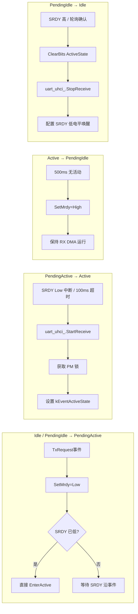
```mermaid
graph LR
    subgraph "Idle / PendingIdle → PendingActive"
        A1[TxRequest事件] --> A2[SetMrdy=Low]
        A2 --> A3{SRDY 已低?}
        A3 -->|是| A4[直接 EnterActive]
        A3 -->|否| A5[等待 SRDY 沿事件]
    end

    subgraph "PendingActive → Active"
        B1[SRDY Low 中断 / 100ms 超时] --> B2[uart_uhci_.StartReceive]
        B2 --> B3[获取 PM 锁]
        B3 --> B4[设置 kEventActiveState]
    end

    subgraph "Active → PendingIdle"
        C1[500ms 无活动] --> C2[SetMrdy=High]
        C2 --> C3[保持 RX DMA 运行]
    end

    subgraph "PendingIdle → Idle"
        D1[SRDY 高 / 轮询确认] --> D2[ClearBits ActiveState]
        D2 --> D3[uart_uhci_.StopReceive]
        D3 --> D4[配置 SRDY 低电平唤醒]
    end
```

### 2.4 MRDY/SRDY 握手协议

**信号定义**：

- **MRDY (Master Ready/DTR)**：ESP32 → Modem
  - `Low` = 忙碌/正在工作，请勿睡眠
  - `High` = 空闲，可以进入睡眠
- **SRDY (Slave Ready/RI)**：Modem → ESP32
  - `Low` = 忙碌/有数据要发送
  - `High` = 空闲

**ACK 脉冲**：每接收到一个完整帧后，Master 发送 50µs 的 MRDY 高电平脉冲作为确认（`SendAckPulse()`，在帧重组完成处调用）。

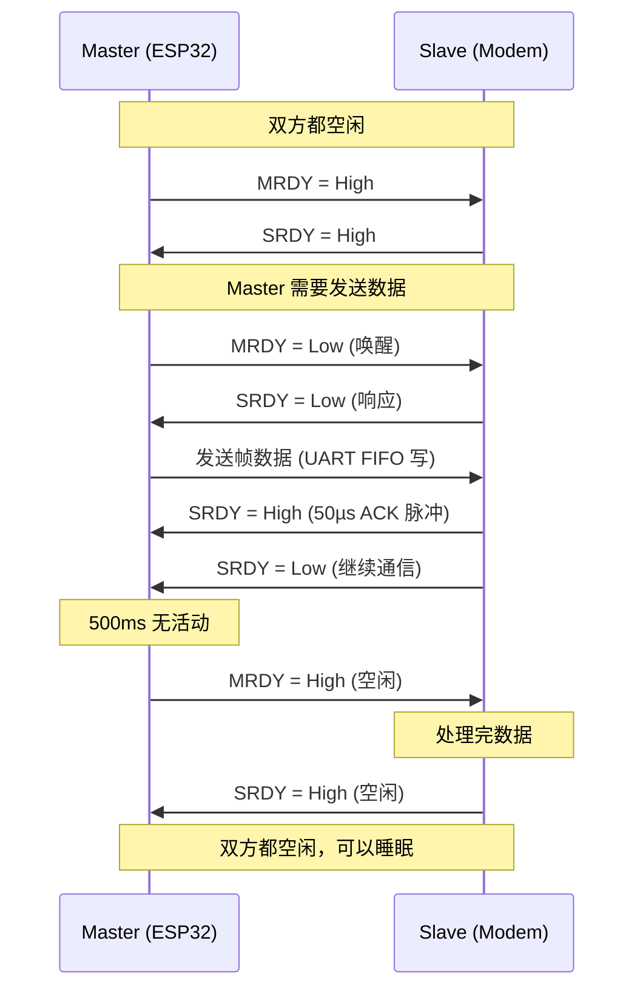
```mermaid
sequenceDiagram
    participant M as Master (ESP32)
    participant S as Slave (Modem)

    Note over M,S: 双方都空闲

    M->>S: MRDY = High
    S->>M: SRDY = High

    Note over M,S: Master 需要发送数据

    M->>S: MRDY = Low (唤醒)
    S->>M: SRDY = Low (响应)

    M->>S: 发送帧数据 (UART FIFO 写)
    S->>M: SRDY = High (50µs ACK 脉冲)
    S->>M: SRDY = Low (继续通信)

    Note over M: 500ms 无活动

    M->>S: MRDY = High (空闲)

    Note over S: 处理完数据

    S->>M: SRDY = High (空闲)

    Note over M,S: 双方都空闲，可以睡眠
```

---

## 3. UART DMA 机制

### 3.1 UHCI 概述

UHCI（Universal Host Controller Interface）是 ESP32 系列芯片提供的硬件加速模块，用于在 UART 与 GDMA 之间建立通道。组件 `components/uart-uhci` 在此基础上提供：

- **接收**：UHCI Idle EOF + GDMA 链表 + Owner 机制实现持续接收。
- **发送**：直接写 UART FIFO（同步阻塞），不占用 GDMA 通道，便于在资源紧张的芯片上节省 DMA 通道（如 ESP32-C5）。
- **PM 锁**：`StartReceive`/`Transmit` 期间持锁，结束后释放。

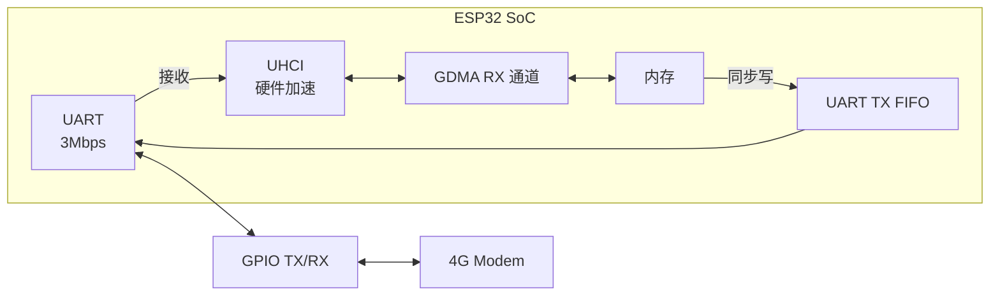
```mermaid
graph LR
    subgraph "ESP32 SoC"
        UART[UART<br/>3Mbps]
        UHCI[UHCI<br/>硬件加速]
        GDMA[GDMA RX 通道]
        FIFO[UART TX FIFO]
        MEM[内存]
    end

    GPIO[GPIO TX/RX]
    MODEM[4G Modem]

    UART -- 接收 --> UHCI
    UHCI <--> GDMA
    GDMA <--> MEM
    MEM -- 同步写 --> FIFO
    FIFO --> UART
    UART <--> GPIO
    GPIO <--> MODEM
```

### 3.2 RX：缓冲区池 + GDMA Owner 机制

`UartUhci` 在 `Init()` 时根据 `BufferPoolConfig` 预分配一组缓冲区，所有缓冲区都挂载到 GDMA 链表，并启用 GDMA 的 owner 检查策略。每个节点附带 `mark_eof = 1`，配合 UHCI 的 `UHCI_RX_IDLE_EOF` 模式，使得：

- 缓冲区被填满 **或** UART 总线进入空闲（idle）时，当前节点完成；
- 节点 owner 被切换为 CPU，并触发 `on_recv_done`；
- 用户处理完毕调用 `ReturnBuffer()`，将 owner 写回 DMA，DMA 继续在该节点上接收。

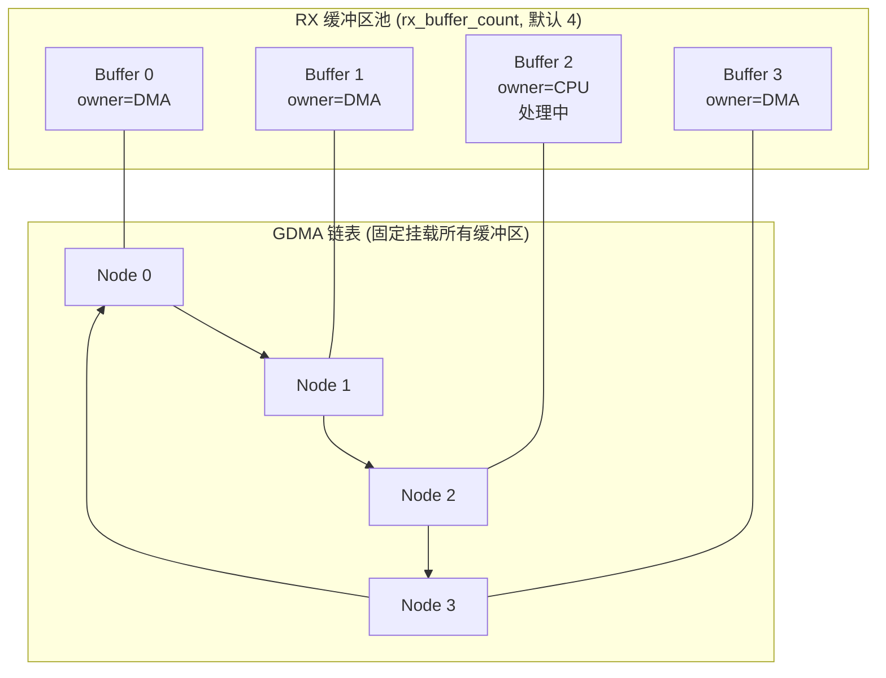
```mermaid
graph TB
    subgraph "RX 缓冲区池 (rx_buffer_count, 默认 4)"
        B0[Buffer 0<br/>owner=DMA]
        B1[Buffer 1<br/>owner=DMA]
        B2[Buffer 2<br/>owner=CPU<br/>处理中]
        B3[Buffer 3<br/>owner=DMA]
    end

    subgraph "GDMA 链表 (固定挂载所有缓冲区)"
        N0[Node 0] --> N1[Node 1] --> N2[Node 2] --> N3[Node 3] --> N0
    end

    B0 --- N0
    B1 --- N1
    B2 --- N2
    B3 --- N3
```

**工作流程**：

1. **初始化**：分配 `rx_buffer_count` 个缓冲区，全部挂载到 GDMA 链表，owner 全部为 DMA。
2. **接收**：DMA 把数据写入当前节点；遇到 idle EOF 或写满时，将 owner 切到 CPU 并触发 `on_recv_done`。
3. **回调**：`HandleGdmaRxDone` 在 ISR 中按节点顺序扫描所有 owner=CPU 的缓冲区（idle 模式下可能多块同时完成），同步 cache 后通过 `RxCallback` 派发给上层。
4. **归还**：`UartEthModem` 在主任务处理完数据后调用 `ReturnBuffer()`，将 owner 写回 DMA 并触发 `gdma_append` 让链表继续运行。
5. **溢出**：若所有缓冲区都被 CPU 占用，DMA 会触发 `on_descr_err`（`HandleGdmaDescrErr`），设置 `buffer_overflow_` 并暂停 RX。等到所有缓冲区都被归还后，自动 flush UART RX FIFO 并 `RemountAndRestartDma` 恢复。

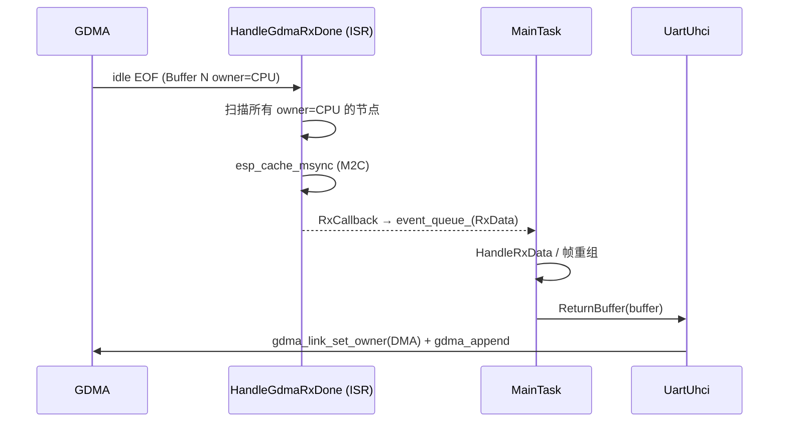
```mermaid
sequenceDiagram
    participant DMA as GDMA
    participant ISR as HandleGdmaRxDone (ISR)
    participant MAIN as MainTask
    participant UHCI as UartUhci

    DMA->>ISR: idle EOF (Buffer N owner=CPU)
    ISR->>ISR: 扫描所有 owner=CPU 的节点
    ISR->>ISR: esp_cache_msync (M2C)
    ISR-->>MAIN: RxCallback → event_queue_(RxData)

    MAIN->>MAIN: HandleRxData / 帧重组
    MAIN->>UHCI: ReturnBuffer(buffer)
    UHCI->>DMA: gdma_link_set_owner(DMA) + gdma_append
```

### 3.3 TX：UART FIFO 同步写入

为了节省 GDMA 通道（特别是在 ESP32-C5 等资源紧张的平台上），TX **没有** 启用 DMA：

- `UartUhci::Transmit()` 直接调用 `uart_ll_write_txfifo` 循环写入；
- FIFO 满时短延时（10µs）后重试；
- 所有数据写完后，等待 `uart_ll_is_tx_idle` 确保最后一个字节已经从硬件移出；
- 进入/退出该函数时分别 `esp_pm_lock_acquire`/`release`，避免 light sleep 打断发送。

帧的串行化由上层 `TxTask` 负责（详见 §7.1）。

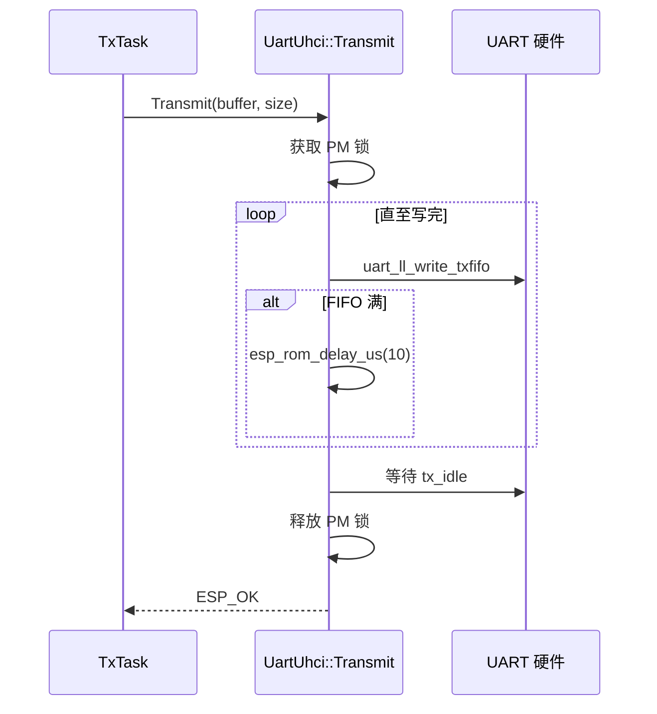
```mermaid
sequenceDiagram
    participant TX as TxTask
    participant UHCI as UartUhci::Transmit
    participant HW as UART 硬件

    TX->>UHCI: Transmit(buffer, size)
    UHCI->>UHCI: 获取 PM 锁
    loop 直至写完
        UHCI->>HW: uart_ll_write_txfifo
        alt FIFO 满
            UHCI->>UHCI: esp_rom_delay_us(10)
        end
    end
    UHCI->>HW: 等待 tx_idle
    UHCI->>UHCI: 释放 PM 锁
    UHCI-->>TX: ESP_OK
```

### 3.4 PM 锁管理

PM 锁用于防止系统在数据收发期间进入 Light Sleep。

| 操作 | PM 锁动作 | 调用位置 |
|------|----------|----------|
| `UartUhci::Transmit()` | 进入获取 / 退出释放 | TX FIFO 写入区间 |
| `UartUhci::StartReceive()` | 获取 | 进入 `Active`/`PendingActive` 时 |
| `UartUhci::StopReceive()` | 释放 | 进入 `Idle` 时 |

> `UartEthModem` 不直接管理 PM 锁，全部由 `UartUhci` 在上述时机持/放，简化了状态机。

---

## 4. 帧协议格式

### 4.1 帧头结构 (4 字节)

```
┌────────────────────────────────────────────────────────────────┐
│ Byte 0         │ Byte 1                  │ Byte 2          │ Byte 3  │
├────────────────┼─────────────────────────┼─────────────────┼─────────┤
│ payload_len    │ seq_no [7:4] │ len[11:8]│ rsv │type│cont│fc│ chksum  │
│ [7:0]          │              │          │[7:4]│[3:2]│[1] │[0]│         │
└────────────────┴─────────────────────────┴─────────────────┴─────────┘
```

字段说明：

- `payload_length [11:0]`：载荷长度（最大 4095，但实际受 `kMaxFrameSize - 4 = 1596` 限制）。
- `seq_no [3:0]`：序列号 (0-15 循环，由 `seq_no_` 原子计数器递增)。
- `type [1:0]`：帧类型（0 = Ethernet，1 = AT 命令/响应）。
- `continue [1]`：分片标志。
- `flow_control [0]`：流控（0 = XON 允许发送，1 = XOFF 暂停发送）。
- `checksum`：`((sum >> 8) ^ sum ^ 0x03) & 0xFF`，其中 `sum = raw[0] + raw[1] + raw[2]`。

### 4.2 完整帧结构

```
┌──────────────────────┬───────────────────────────────┐
│   FrameHeader        │   Ethernet Frame / AT Cmd    │
│   (4 bytes)          │   (0 - 1596 bytes)           │
└──────────────────────┴───────────────────────────────┘

最大帧大小: kMaxFrameSize = 1600 字节
```

### 4.3 帧类型

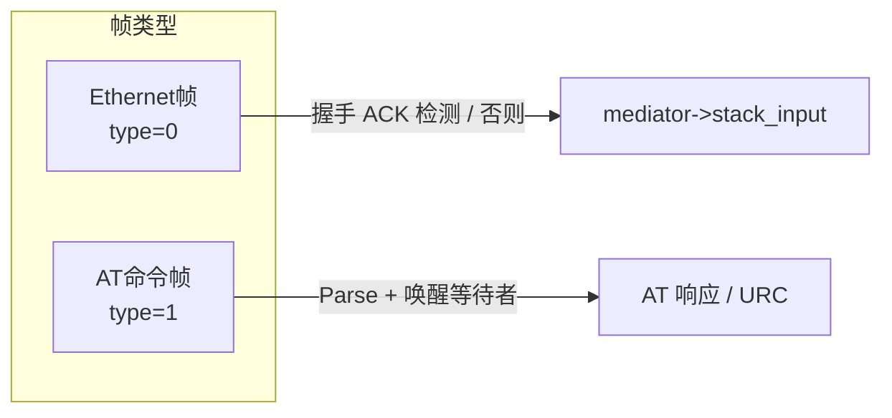
```mermaid
graph LR
    subgraph "帧类型"
        ETH[Ethernet帧<br/>type=0]
        AT[AT命令帧<br/>type=1]
    end

    ETH -->|握手 ACK 检测 / 否则| NETIF[mediator->stack_input]
    AT -->|Parse + 唤醒等待者| RESP[AT 响应 / URC]
```

> 握手帧 (`kHandshakeRequest` / `kHandshakeAck`) 也走 Ethernet 类型。`HandleEthFrame` 在 `handshake_done_=false` 时优先匹配握手 ACK。

---

## 5. 事件处理机制

### 5.1 事件类型

```cpp
enum class EventType : uint8_t {
    None = 0,
    TxRequest,    // TxTask 请求进入 Active 以便发送
    SrdyLow,      // SRDY 信号变低 (有数据或响应唤醒)
    SrdyHigh,     // SRDY 信号变高 (ACK 或进入睡眠)
    RxData,       // 收到 GDMA 缓冲区
    Stop,         // 停止请求 (Stop() 触发)
};
```

事件结构同时携带 `RxBuffer*`（仅 `RxData` 使用）。

### 5.2 MainTask 事件循环

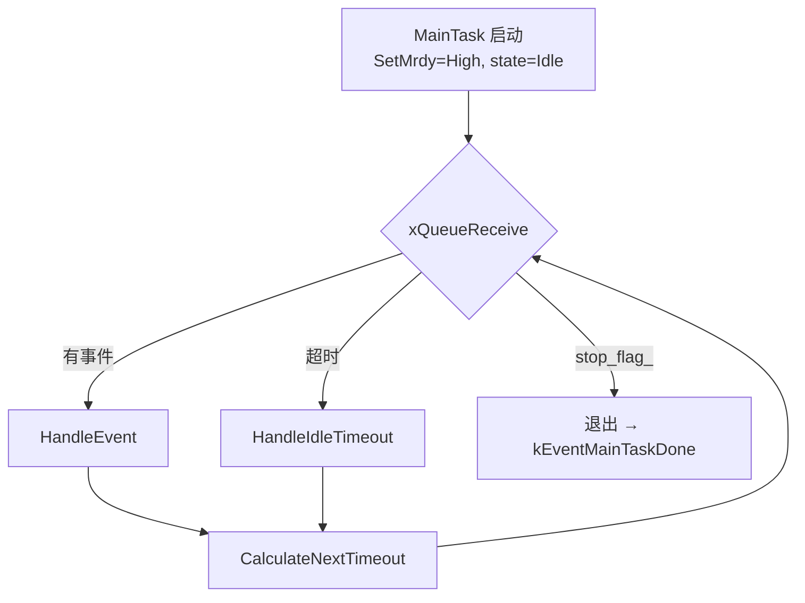
```mermaid
graph TB
    START[MainTask 启动<br/>SetMrdy=High, state=Idle] --> LOOP{xQueueReceive}
    LOOP -->|有事件| HANDLE[HandleEvent]
    LOOP -->|超时| TIMEOUT[HandleIdleTimeout]
    HANDLE --> CALC[CalculateNextTimeout]
    TIMEOUT --> CALC
    CALC --> LOOP
    LOOP -->|stop_flag_| EXIT[退出 → kEventMainTaskDone]
```

`CalculateNextTimeout` 根据状态返回不同等待时间：

| 状态 | 超时 |
|------|------|
| `Idle` | `portMAX_DELAY` |
| `PendingActive` | 100 ms（等待 SRDY Low） |
| `Active` | `kIdleTimeoutMs - elapsed`，到点触发空闲超时 |
| `PendingIdle` | 10 ms（轮询 SRDY） |

**事件来源**：

```mermaid
graph TB
    subgraph "事件源"
        ISR1[SRDY GPIO ISR]
        ISR2[GDMA RX done ISR]
        TT[TxTask]
        APP[Stop / 应用层]
    end

    subgraph "事件队列"
        QUEUE[event_queue_<br/>FreeRTOS Queue (深度 32)]
    end

    subgraph "MainTask"
        RECV[xQueueReceive]
        HANDLE[HandleEvent]
        TIMEOUT[HandleIdleTimeout]
    end

    ISR1 -->|SrdyLow / SrdyHigh| QUEUE
    ISR2 -->|RxData| QUEUE
    TT -->|TxRequest| QUEUE
    APP -->|Stop| QUEUE

    QUEUE --> RECV
    RECV --> HANDLE
    RECV -->|超时| TIMEOUT
```

### 5.3 中断处理

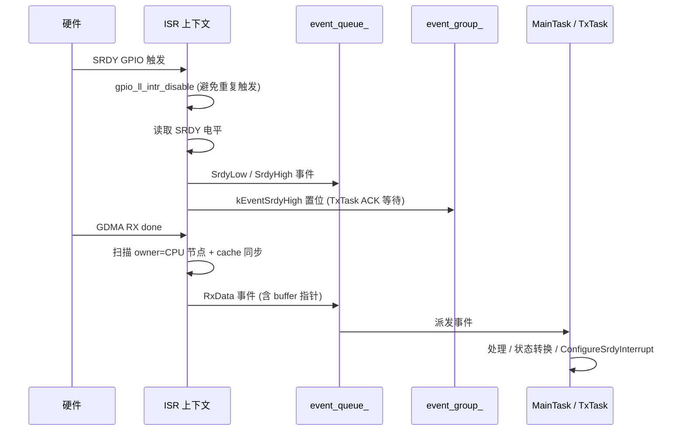
```mermaid
sequenceDiagram
    participant HW as 硬件
    participant ISR as ISR 上下文
    participant QUEUE as event_queue_
    participant EG as event_group_
    participant TASK as MainTask / TxTask

    HW->>ISR: SRDY GPIO 触发
    ISR->>ISR: gpio_ll_intr_disable (避免重复触发)
    ISR->>ISR: 读取 SRDY 电平
    ISR->>QUEUE: SrdyLow / SrdyHigh 事件
    ISR->>EG: kEventSrdyHigh 置位 (TxTask ACK 等待)

    HW->>ISR: GDMA RX done
    ISR->>ISR: 扫描 owner=CPU 节点 + cache 同步
    ISR->>QUEUE: RxData 事件 (含 buffer 指针)

    QUEUE->>TASK: 派发事件
    TASK->>TASK: 处理 / 状态转换 / ConfigureSrdyInterrupt
```

> SRDY 中断在 `ConfigureSrdyInterrupt(true)` 下为 `GPIO_INTR_LOW_LEVEL`（用于 light sleep 唤醒）；在 `ConfigureSrdyInterrupt(false)` 下为 `GPIO_INTR_ANYEDGE`（捕获 ACK 脉冲及任意沿）。每次 ISR 触发后会临时禁用中断，避免重复触发，待主任务/TxTask 处理完后再次开启。

---

## 6. 初始化流程

### 6.1 完整启动序列

```mermaid
graph TB
    START[Start(flight_mode)] --> CREATEQ[创建 event_queue_]
    CREATEQ --> CREATETXQ[创建 tx_queue_<br/>(深度 kTxQueueDepth)]
    CREATETXQ --> INITUART[InitUart<br/>配置 UART 参数 + 引脚]
    INITUART --> INITGPIO[InitGpio<br/>MRDY 输出 / SRDY 输入 + ISR + 唤醒]
    INITGPIO --> ALLOC[分配 reassembly_buffer_]
    ALLOC --> INITUHCI[uart_uhci_.Init<br/>RX 池 + GDMA + PM 锁]
    INITUHCI --> CB[SetRxCallback]
    CB --> CREATETASK[创建 MainTask / InitTask / TxTask]
    CREATETASK --> SIGNAL[xEventGroupSetBits(kEventStart)]
    SIGNAL --> RET[Start 返回 ESP_OK<br/>初始化继续异步进行]
```

> 失败通过事件回调 (`ErrorInitFailed` / `ErrorNoSim` / `ErrorRegistrationDenied` 等) 上报，调用方收到失败事件后应调用 `Stop()` 释放资源。

### 6.2 InitTask 初始化序列（普通模式）

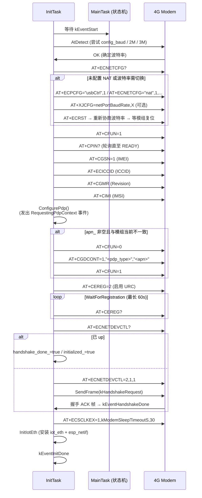
```mermaid
sequenceDiagram
    participant INIT as InitTask
    participant MAIN as MainTask (状态机)
    participant MODEM as 4G Modem

    INIT->>MAIN: 等待 kEventStart
    INIT->>MODEM: AtDetect (尝试 config_baud / 2M / 3M)
    MODEM->>INIT: OK (确定波特率)

    INIT->>MODEM: AT+ECNETCFG?
    alt 未配置 NAT 或波特率需切换
        INIT->>MODEM: AT+ECPCFG="usbCtrl",1 / AT+ECNETCFG="nat",1,...
        INIT->>MODEM: AT+XJCFG=netPortBaudRate,X (可选)
        INIT->>MODEM: AT+ECRST → 重新协商波特率 → 等模组复位
    end

    INIT->>MODEM: AT+CFUN=1
    INIT->>MODEM: AT+CPIN? (轮询直至 READY)

    INIT->>MODEM: AT+CGSN=1 (IMEI)
    INIT->>MODEM: AT+ECICCID (ICCID)
    INIT->>MODEM: AT+CGMR (Revision)
    INIT->>MODEM: AT+CIMI (IMSI)

    INIT->>INIT: ConfigurePdp()<br/>(发出 RequestingPdpContext 事件)
    alt apn_ 非空且与模组当前不一致
        INIT->>MODEM: AT+CFUN=0
        INIT->>MODEM: AT+CGDCONT=1,"<pdp_type>","<apn>"
        INIT->>MODEM: AT+CFUN=1
    end

    INIT->>MODEM: AT+CEREG=2 (启用 URC)
    loop WaitForRegistration (最长 60s)
        INIT->>MODEM: AT+CEREG?
    end

    INIT->>MODEM: AT+ECNETDEVCTL?
    alt 已 up
        INIT->>INIT: handshake_done_=true / initialized_=true
    else
        INIT->>MODEM: AT+ECNETDEVCTL=2,1,1
        INIT->>MODEM: SendFrame(kHandshakeRequest)
        MODEM->>INIT: 握手 ACK 帧 → kEventHandshakeDone
    end

    INIT->>MODEM: AT+ECSCLKEX=1,kModemSleepTimeoutS,30

    INIT->>INIT: InitIotEth (安装 iot_eth + esp_netif)
    INIT->>INIT: kEventInitDone
```

**飞行模式 (`flight_mode=true`)** 流程：`AtDetect → AT+CFUN=4 → CheckSimCard → QueryModemInfo`，跳过网络注册和 `iot_eth` 安装，最后发出 `InFlightMode` 事件。

---

## 7. 数据流

### 7.1 发送数据流

帧发送统一通过 `tx_queue_` 异步入队，由 `TxTask` 串行化处理，避免 LWIP / AT / 握手路径相互阻塞。

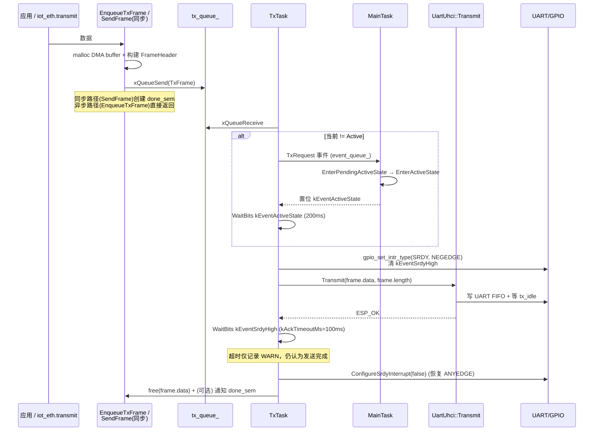
```mermaid
sequenceDiagram
    participant APP as 应用 / iot_eth.transmit
    participant ENQ as EnqueueTxFrame /<br/>SendFrame(同步)
    participant TQ as tx_queue_
    participant TX as TxTask
    participant MAIN as MainTask
    participant UHCI as UartUhci::Transmit
    participant HW as UART/GPIO

    APP->>ENQ: 数据
    ENQ->>ENQ: malloc DMA buffer + 构建 FrameHeader
    ENQ->>TQ: xQueueSend(TxFrame)
    note over ENQ: 同步路径(SendFrame)创建 done_sem<br/>异步路径(EnqueueTxFrame)直接返回

    TX->>TQ: xQueueReceive
    alt 当前 != Active
        TX->>MAIN: TxRequest 事件 (event_queue_)
        MAIN->>MAIN: EnterPendingActiveState → EnterActiveState
        MAIN-->>TX: 置位 kEventActiveState
        TX->>TX: WaitBits kEventActiveState (200ms)
    end

    TX->>HW: gpio_set_intr_type(SRDY, NEGEDGE)<br/>清 kEventSrdyHigh
    TX->>UHCI: Transmit(frame.data, frame.length)
    UHCI->>HW: 写 UART FIFO + 等 tx_idle
    UHCI-->>TX: ESP_OK

    TX->>TX: WaitBits kEventSrdyHigh (kAckTimeoutMs=100ms)
    note over TX: 超时仅记录 WARN，仍认为发送完成

    TX->>HW: ConfigureSrdyInterrupt(false) (恢复 ANYEDGE)
    TX->>ENQ: free(frame.data) + (可选) 通知 done_sem
```

要点：

- LWIP 调用 `driver_.transmit` 经 `EnqueueTxFrame`，**不阻塞**，队列满返回 `ESP_ERR_NO_MEM`；
- AT/握手通过 `SendFrame` 创建 `done_sem`（2s 超时）等待完成；
- `TxTask` 优先级略低于 `MainTask`，确保事件循环优先响应；
- ACK 等待依赖 `event_group_` 的 `kEventSrdyHigh` 位（由 SRDY ISR 置位）。

### 7.2 接收数据流

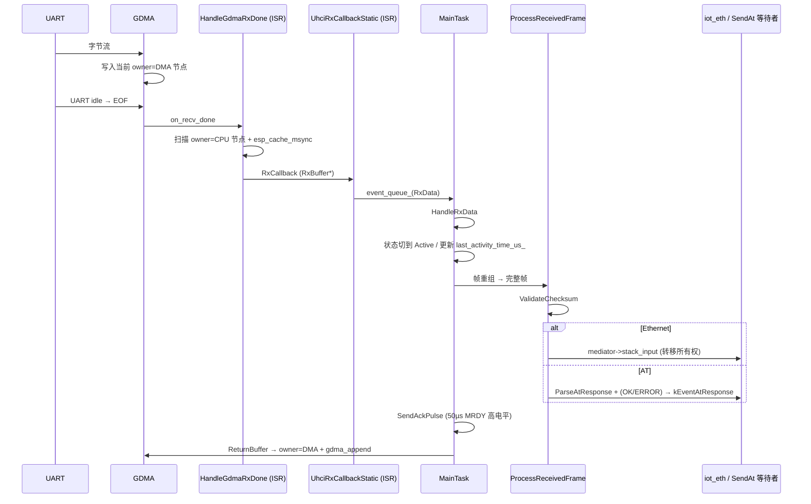
```mermaid
sequenceDiagram
    participant HW as UART
    participant DMA as GDMA
    participant ISR as HandleGdmaRxDone (ISR)
    participant CB as UhciRxCallbackStatic (ISR)
    participant MAIN as MainTask
    participant FRAME as ProcessReceivedFrame
    participant APP as iot_eth / SendAt 等待者

    HW->>DMA: 字节流
    DMA->>DMA: 写入当前 owner=DMA 节点
    HW->>DMA: UART idle → EOF
    DMA->>ISR: on_recv_done
    ISR->>ISR: 扫描 owner=CPU 节点 + esp_cache_msync
    ISR->>CB: RxCallback (RxBuffer*)
    CB->>MAIN: event_queue_(RxData)

    MAIN->>MAIN: HandleRxData
    MAIN->>MAIN: 状态切到 Active / 更新 last_activity_time_us_
    MAIN->>FRAME: 帧重组 → 完整帧
    FRAME->>FRAME: ValidateChecksum
    alt Ethernet
        FRAME->>APP: mediator->stack_input (转移所有权)
    else AT
        FRAME->>APP: ParseAtResponse + (OK/ERROR) → kEventAtResponse
    end
    MAIN->>MAIN: SendAckPulse (50µs MRDY 高电平)
    MAIN->>DMA: ReturnBuffer → owner=DMA + gdma_append
```

> 由于 UHCI 在 idle EOF 模式下可能在一次中断里完成多个节点，`HandleGdmaRxDone` 会顺序扫描所有 `owner=CPU` 的节点；上层在一个回调中可能收到多块缓冲区。每个完整帧处理完成后才调用 `SendAckPulse`，避免对未完整帧错误确认。

---

## 8. 低功耗管理

### 8.1 睡眠/唤醒流程

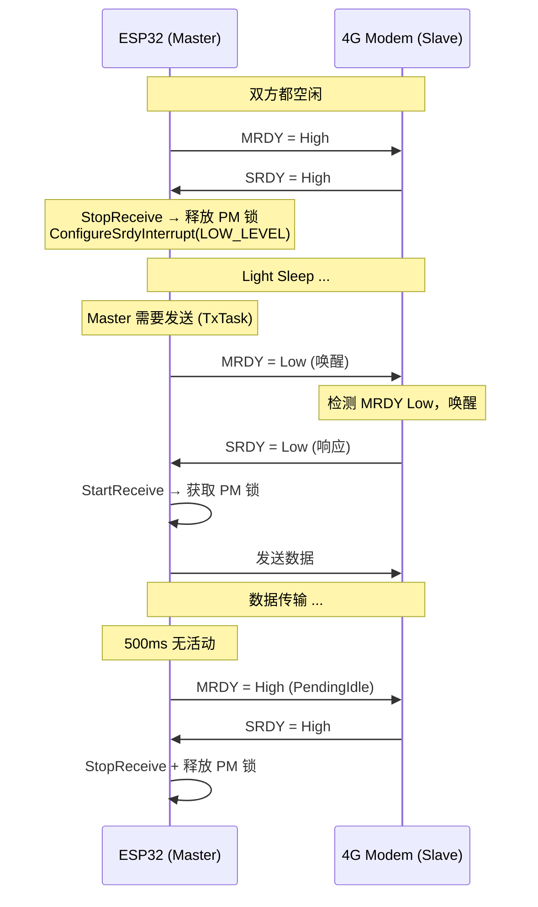
```mermaid
sequenceDiagram
    participant ESP32 as ESP32 (Master)
    participant MODEM as 4G Modem (Slave)

    Note over ESP32,MODEM: 双方都空闲

    ESP32->>MODEM: MRDY = High
    MODEM->>ESP32: SRDY = High

    Note over ESP32: StopReceive → 释放 PM 锁<br/>ConfigureSrdyInterrupt(LOW_LEVEL)

    Note over ESP32,MODEM: Light Sleep ...

    Note over ESP32: Master 需要发送 (TxTask)

    ESP32->>MODEM: MRDY = Low (唤醒)
    Note over MODEM: 检测 MRDY Low，唤醒
    MODEM->>ESP32: SRDY = Low (响应)
    ESP32->>ESP32: StartReceive → 获取 PM 锁

    ESP32->>MODEM: 发送数据
    Note over ESP32,MODEM: 数据传输 ...

    Note over ESP32: 500ms 无活动

    ESP32->>MODEM: MRDY = High (PendingIdle)
    MODEM->>ESP32: SRDY = High
    ESP32->>ESP32: StopReceive + 释放 PM 锁
```

### 8.2 低功耗状态对应

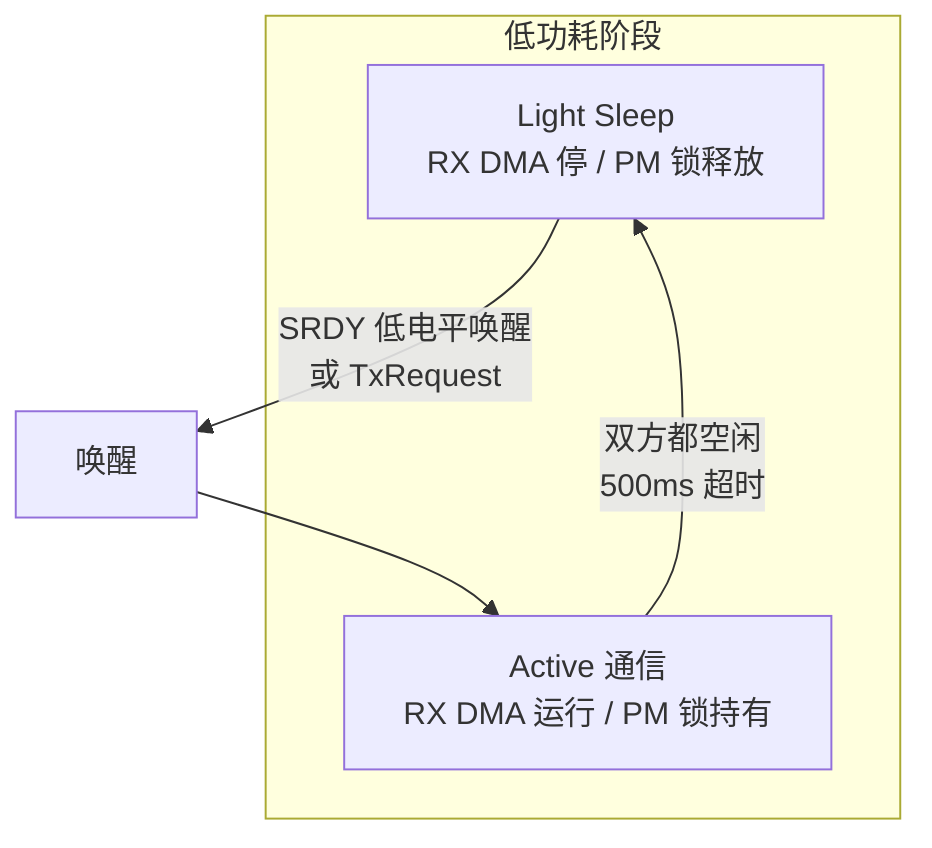
```mermaid
graph TB
    subgraph "低功耗阶段"
        SLEEP[Light Sleep<br/>RX DMA 停 / PM 锁释放]
        ACTIVE[Active 通信<br/>RX DMA 运行 / PM 锁持有]
    end

    SLEEP -->|SRDY 低电平唤醒<br/>或 TxRequest| WAKE[唤醒]
    WAKE --> ACTIVE
    ACTIVE -->|双方都空闲<br/>500ms 超时| SLEEP
```

---

## 9. 帧重组机制

当一个完整帧分布在多个 RX 缓冲区时，需要进行帧重组。

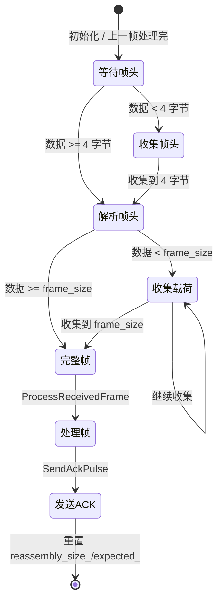
```mermaid
stateDiagram-v2
    [*] --> 等待帧头: 初始化 / 上一帧处理完

    等待帧头 --> 收集帧头: 数据 < 4 字节
    等待帧头 --> 解析帧头: 数据 >= 4 字节

    收集帧头 --> 解析帧头: 收集到 4 字节

    解析帧头 --> 完整帧: 数据 >= frame_size
    解析帧头 --> 收集载荷: 数据 < frame_size

    收集载荷 --> 完整帧: 收集到 frame_size
    收集载荷 --> 收集载荷: 继续收集

    完整帧 --> 处理帧: ProcessReceivedFrame
    处理帧 --> 发送ACK: SendAckPulse
    发送ACK --> [*]: 重置 reassembly_size_/expected_
```

**重组状态变量**：

```cpp
uint8_t* reassembly_buffer_;      // 重组缓冲区 (kMaxFrameSize = 1600 字节)
size_t   reassembly_size_;        // 当前已收集的字节数
size_t   reassembly_expected_;    // 期望的完整帧大小 (header + payload)
```

**示例**：

```
Buffer 1: [帧头前2字节] [帧头后2字节] [载荷前100字节]
          └────拷贝到 reassembly_buffer_────┘

Buffer 2: [载荷中100字节] [载荷后50字节]
          └────继续追加─────┘

reassembly_size_ == reassembly_expected_ → ProcessReceivedFrame + SendAckPulse
```

**额外保护**：

- 帧头校验失败时丢弃当前缓冲区剩余数据；
- 重组过程中若新解析的 header 校验失败或 `frame_size > kMaxFrameSize`，重置重组状态。

---

## 10. 错误处理

### 10.1 常见错误场景

| 错误类型 | 检测方式 | 处理策略 |
|---------|---------|---------|
| **帧校验失败** | `FrameHeader::ValidateChecksum()` 返回 false | 丢弃剩余数据，等待下一次 idle EOF |
| **帧过大** | `frame_size > kMaxFrameSize` | 跳过该字节继续扫描，或重置重组状态 |
| **Slave 无响应** | `PendingActive` 100ms 超时 | 轮询 SRDY，若仍高则强制进入 Active |
| **TX FIFO 阻塞** | FIFO 满时 `esp_rom_delay_us(10)` 重试 | 透明等待直至写完 |
| **TX 队列满** | `xQueueSend(tx_queue_, ...)` 失败 | 异步路径返回 `ESP_ERR_NO_MEM`；同步路径阻塞 100ms 后失败 |
| **ACK 超时** | `kEventSrdyHigh` 100ms 未置位 | 仅 `ESP_LOGW`，认为发送完成（数据通常已到模组） |
| **AT 超时** | `kEventAtResponse` 未置位 | `SendAt` 返回 `ESP_ERR_TIMEOUT` |
| **GDMA 缓冲区耗尽** | `on_descr_err` (`HandleGdmaDescrErr`) | 设置 `buffer_overflow_`，等所有 buffer 归还后 flush UART FIFO 并重启 DMA |

### 10.2 错误恢复流程

```mermaid
graph TB
    ERROR[检测到错误] --> TYPE{错误类型}

    TYPE -->|校验失败| DISCARD[丢弃帧 / 重置重组]
    TYPE -->|超时| RETRY[ESP_ERR_TIMEOUT 上报]
    TYPE -->|缓冲区耗尽| OVF[等待全部归还 → 自动重启 DMA]
    TYPE -->|启动序列失败| STOPF[设置 stop_flag_ + ErrorXxx 事件]

    DISCARD --> CONTINUE[继续运行]
    RETRY --> CONTINUE
    OVF --> CONTINUE
    STOPF --> CALLER[调用方负责 Stop()]
```

### 10.3 资源清理 (`Stop()` → `CleanupResources(true)`)

```mermaid
graph TB
    STOP[Stop调用] --> FLAG[stop_flag_ = true]
    FLAG --> NUDGE[向 event_queue_ / tx_queue_<br/>各送一个唤醒事件]
    NUDGE --> WAIT[等 kEventAllTasksDone (10s)]
    WAIT --> CLEAN[CleanupResources]

    CLEAN --> ETH[DeinitIotEth<br/>(注销 IP handler / glue / netif / iot_eth)]
    ETH --> UHCI[uart_uhci_.Deinit<br/>(StopReceive + 释放 GDMA / PM 锁)]
    UHCI --> RBUF[释放 reassembly_buffer_]
    RBUF --> TQ[排空并删除 tx_queue_]
    TQ --> EQ[排空并删除 event_queue_]
    EQ --> GPIO[DeinitGpio<br/>(禁用唤醒 / 移除 ISR / 复位引脚)]
    GPIO --> UART[DeinitUart<br/>(断开引脚 / 复位 GPIO)]
    UART --> DONE[完成 → initialized_=false]
```

---

## 11. 关键配置参数

```cpp
// 帧 / 缓冲区
static constexpr size_t kMaxFrameSize = 1600;     // 单帧最大字节
// RX 缓冲区池来自 Config (默认值)
Config::rx_buffer_count = 4;                      // ≥ 2
Config::rx_buffer_size  = 1600;

// 状态机超时
static constexpr int64_t kIdleTimeoutMs   = 500;  // Active → PendingIdle
static constexpr int64_t kAckTimeoutMs    = 100;  // 等 SRDY High 作为 ACK
static constexpr int64_t kAckPulseUs      = 50;   // MRDY 高电平 ACK 脉冲

// 启动 / 模组
static constexpr uint32_t kHandshakeTimeoutMs = 5000; // 握手 ACK 等待
static constexpr uint32_t kModemSleepTimeoutS = 3;    // AT+ECSCLKEX=1,3,30

// TX 队列
static constexpr size_t kTxQueueDepth = 32;       // 最多堆积的待发帧

// UART
Config::baud_rate = 3000000; // 3 Mbps (启动时会自动尝试 2M/3M 兜底)
data_bits = 8; parity = none; stop_bits = 1; flow_ctrl = disable;
```

---

## 12. 线程安全

### 12.1 同步机制

| 资源 | 保护机制 | 说明 |
|------|---------|------|
| **AT 命令调用** | `at_mutex_` (std::mutex) | 串行化 `SendAt` 调用 |
| **AT 响应通知** | `event_group_` 中 `kEventAtResponse` | `HandleAtResponse` 收到 OK/ERROR 时置位 |
| **同步发送完成** | `TxFrame::done_sem` (二进制信号量) | `SendFrame` 等待 `TxTask` 完成 |
| **状态/标志位** | `std::atomic<T>` | `working_state_` / `stop_flag_` / `seq_no_` 等 |
| **状态机/任务事件** | `event_group_` | 启动、握手、网络就绪、停止、SRDY High 等 |
| **事件传递** | `event_queue_` (FreeRTOS Queue, ISR safe, 深度 32) | ISR / 任务 → MainTask |
| **TX 入队** | `tx_queue_` (FreeRTOS Queue, 深度 `kTxQueueDepth`) | LWIP/AT → TxTask |

> 已经移除：旧版的 `send_mutex_` 与独立的 AT 响应信号量。当前 AT 响应统一使用 event group，发送串行化由 `TxTask` + 队列保证。

### 12.2 线程模型

```mermaid
graph TB
    subgraph "应用 / LWIP"
        LWIP[LWIP / iot_eth<br/>driver_.transmit]
        APIS[SendAt / 应用 API]
    end

    subgraph "uart_eth_modem 任务"
        MAIN[MainTask<br/>事件循环 + 状态机]
        INIT[InitTask<br/>启动序列]
        TX[TxTask<br/>串行化发送]
    end

    subgraph "ISR 上下文"
        SRDY[SRDY GPIO ISR]
        GDMA_RX[GDMA RX ISR]
    end

    SRDY -->|SrdyLow / SrdyHigh + kEventSrdyHigh| QUEUE[event_queue_]
    GDMA_RX -->|RxData| QUEUE
    QUEUE --> MAIN

    LWIP -->|EnqueueTxFrame| TQ[tx_queue_]
    APIS -->|SendFrame + done_sem| TQ
    TQ --> TX
    TX -->|TxRequest| QUEUE
    MAIN -. kEventActiveState .-> TX

    INIT -.->|kEventStart / kEventInitDone| EG[event_group_]
    APIS -.->|kEventAtResponse / kEventStop| EG
```

---

## 13. 性能优化

### 13.1 RX 缓冲区池优势

- **零拷贝**：GDMA 直接写入预分配缓冲区，回调中只做 cache 同步与指针传递。
- **持续接收**：DMA 与帧重组解耦，CPU 还在处理上一块时 DMA 可以继续填充其它节点。
- **低延迟**：UHCI 的 idle EOF 模式让短帧也能尽快上抛，不必等到缓冲区写满。

### 13.2 状态机优化

- **快速唤醒**：`EnterPendingActiveState` 进入前先轮询 SRDY，已低则直接转 Active，避免无谓等待。
- **智能超时**：`CalculateNextTimeout` 根据状态返回不同等待时间，`Active` 下用剩余时间精确触发空闲超时。
- **PM 锁集中管理**：仅在 `StartReceive`/`Transmit` 期间持锁，500ms 空闲后自动 `StopReceive` 释放。
- **TX 串行化**：所有发送统一走 `TxTask + tx_queue_`，避免 LWIP 阻塞与并发资源竞争。

---

## 14. 调试建议

### 14.1 启用调试日志

```cpp
modem.SetDebug(true);
```

启用后驱动内的细节日志（帧解析、状态切换、ACK 时序等）会以 `ESP_LOGI` 输出。

### 14.2 关键日志点

- 状态转换：`EnterActiveState()` / `EnterPendingActiveState()` / `EnterPendingIdleState()` / `EnterIdleState()`
- 帧处理：`ProcessReceivedFrame()` / `SendFrame()` / `EnqueueTxFrame()`
- DMA 事件：`UartUhci::HandleGdmaRxDone()` / `HandleGdmaDescrErr()`（缓冲区溢出）
- TX 时序：`TxTask: ACK timeout` / `frame sent, X bytes, acked in Y us`
- 启动序列：`AtDetect` 检出的波特率、`AT+CEREG?` 状态、握手成功/超时

### 14.3 常见问题排查

1. **Slave 无响应 / TX ACK 持续超时**：检查 MRDY/SRDY 接线、电平翻转方向以及模组是否进入低功耗。
2. **帧丢失 / `descr_err` 警告**：`rx_buffer_count` 偏小导致缓冲区耗尽；适当增大池大小或优化主任务处理速度。
3. **AT 超时**：检查 UART 波特率（启动会自适应 115200/2M/3M），以及 `flow_ctrl` 是否正确禁用。
4. **PM 锁未释放**：检查是否长时间停留在 `Active`/`PendingIdle` 状态（如帧重组卡住），确认 `last_activity_time_us_` 是否更新。
5. **PDP / APN 不生效**：在 `Start()` 之前调用 `SetPdpContext`，或在 `RequestingPdpContext` 同步回调中注入。

---

**文档版本**：2.0
**最后更新**：2026-05-07
**适用模块**：EC801E / NT26K 等支持 UART NAT 模式的 4G 模块
