# UART Ethernet Modem 工作原理文档

本文档详细描述了 UART Ethernet Modem 驱动的工作原理，包括状态机转换、UART DMA 机制、低功耗管理等核心内容。

## 目录

1. [系统架构概述](#1-系统架构概述)
2. [状态机详解](#2-状态机详解)
3. [UART DMA 机制](#3-uart-dma-机制)
4. [帧协议格式](#4-帧协议格式)
5. [事件处理机制](#5-事件处理机制)
6. [初始化流程](#6-初始化流程)
7. [数据流](#7-数据流)
8. [低功耗管理](#8-低功耗管理)
9. [帧重组机制](#9-帧重组机制)
10. [错误处理](#10-错误处理)

---

## 1. 系统架构概述

UART Ethernet Modem 驱动采用分层架构，通过 UHCI DMA 实现高效的数据传输，并通过状态机管理低功耗模式。

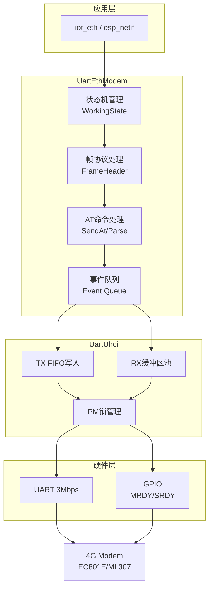
```mermaid
graph TB
    subgraph "应用层"
        APP[iot_eth / esp_netif]
    end
    
    subgraph "UartEthModem"
        SM[状态机管理<br/>WorkingState]
        FP[帧协议处理<br/>FrameHeader]
        AT[AT命令处理<br/>SendAt/Parse]
        EQ[事件队列<br/>Event Queue]
    end
    
    subgraph "UartUhci"
        TXFIFO[TX FIFO写入]
        RXPOOL[RX缓冲区池]
        PM[PM锁管理]
    end
    
    subgraph "硬件层"
        UART[UART 3Mbps]
        GPIO[GPIO<br/>MRDY/SRDY]
    end
    
    MODEM[4G Modem<br/>EC801E/ML307]
    
    APP --> SM
    SM --> FP
    FP --> AT
    AT --> EQ
    EQ --> TXFIFO
    EQ --> RXPOOL
    TXFIFO --> PM
    RXPOOL --> PM
    PM --> UART
    PM --> GPIO
    UART --> MODEM
    GPIO --> MODEM
```

### 核心组件

- **UartEthModem**: 主驱动类，管理状态机、帧协议、AT命令
- **UartUhci**: UHCI DMA 控制器，提供高效的 DMA 传输
- **事件队列**: 统一的事件处理机制，连接 ISR 和主任务
- **状态机**: 管理低功耗状态转换和 DMA 启停

---

## 2. 状态机详解

### 2.1 WorkingState 状态机

状态机用于管理低功耗模式，控制 DMA 的启停和 MRDY/SRDY 信号。

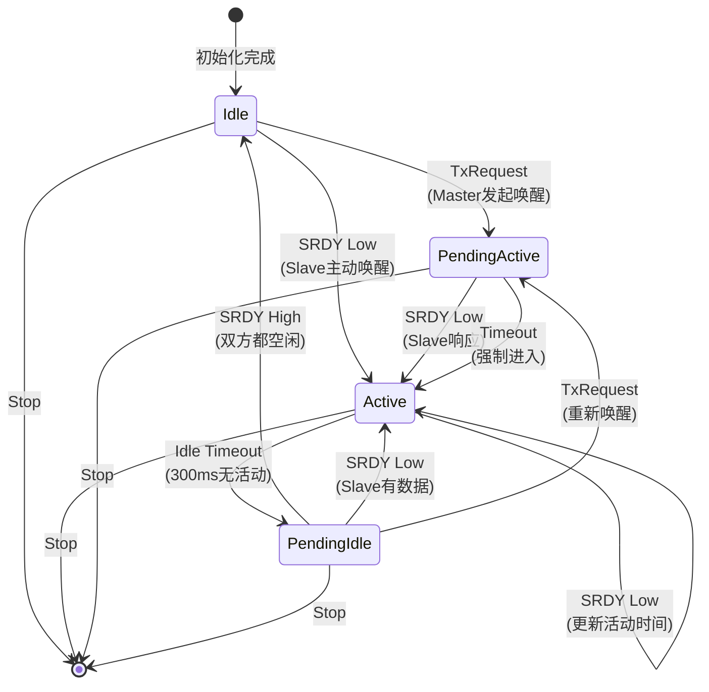
```mermaid
stateDiagram-v2
    [*] --> Idle: 初始化完成
    
    Idle --> PendingActive: TxRequest<br/>(Master发起唤醒)
    Idle --> Active: SRDY Low<br/>(Slave主动唤醒)
    
    PendingActive --> Active: SRDY Low<br/>(Slave响应)
    PendingActive --> Active: Timeout<br/>(强制进入)
    
    Active --> PendingIdle: Idle Timeout<br/>(300ms无活动)
    Active --> Active: SRDY Low<br/>(更新活动时间)
    
    PendingIdle --> Idle: SRDY High<br/>(双方都空闲)
    PendingIdle --> Active: SRDY Low<br/>(Slave有数据)
    PendingIdle --> PendingActive: TxRequest<br/>(重新唤醒)
    
    Idle --> [*]: Stop
    Active --> [*]: Stop
    PendingActive --> [*]: Stop
    PendingIdle --> [*]: Stop
```

### 2.2 状态说明

| 状态 | DMA状态 | MRDY | SRDY | PM锁 | 说明 |
|------|---------|------|------|------|------|
| **Idle** | 停止 | High | High | 释放 | 双方空闲，允许进入 Light Sleep |
| **PendingActive** | 停止 | Low | High→Low | 释放 | Master 发起唤醒，等待 Slave 响应 |
| **Active** | 运行 | Low | Low | 持有 | 活动通信中，禁止睡眠 |
| **PendingIdle** | 运行 | High | Low→High | 持有 | Master 空闲，等待 Slave 也空闲 |

### 2.3 状态转换触发条件

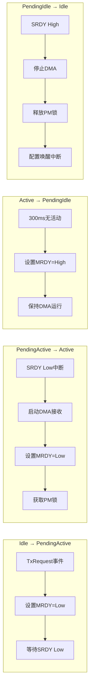
```mermaid
graph LR
    subgraph "Idle → PendingActive"
        A1[TxRequest事件] --> A2[设置MRDY=Low]
        A2 --> A3[等待SRDY Low]
    end
    
    subgraph "PendingActive → Active"
        B1[SRDY Low中断] --> B2[启动DMA接收]
        B2 --> B3[设置MRDY=Low]
        B3 --> B4[获取PM锁]
    end
    
    subgraph "Active → PendingIdle"
        C1[300ms无活动] --> C2[设置MRDY=High]
        C2 --> C3[保持DMA运行]
    end
    
    subgraph "PendingIdle → Idle"
        D1[SRDY High] --> D2[停止DMA]
        D2 --> D3[释放PM锁]
        D3 --> D4[配置唤醒中断]
    end
```

### 2.4 MRDY/SRDY 握手协议

**信号定义**:
- **MRDY (Master Ready/DTR)**: ESP32 → Modem
  - `Low` = 忙碌/正在工作，请勿睡眠
  - `High` = 空闲，可以进入睡眠

- **SRDY (Slave Ready/RI)**: Modem → ESP32
  - `Low` = 忙碌/有数据要发送
  - `High` = 空闲，可以进入睡眠

**ACK 脉冲**: 收到完整帧后，发送 50μs 的 MRDY 高电平脉冲作为确认

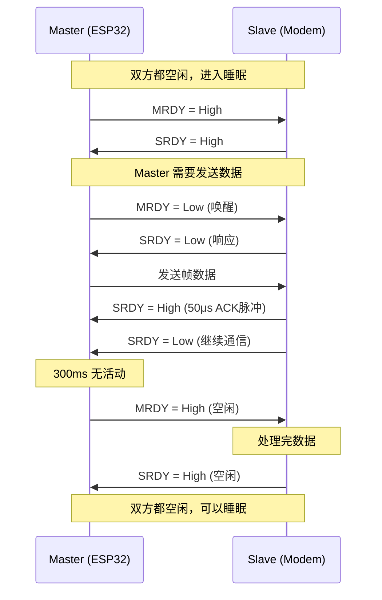
```mermaid
sequenceDiagram
    participant M as Master (ESP32)
    participant S as Slave (Modem)
    
    Note over M,S: 双方都空闲，进入睡眠
    
    M->>S: MRDY = High
    S->>M: SRDY = High
    
    Note over M,S: Master 需要发送数据
    
    M->>S: MRDY = Low (唤醒)
    S->>M: SRDY = Low (响应)
    
    M->>S: 发送帧数据
    S->>M: SRDY = High (50μs ACK脉冲)
    S->>M: SRDY = Low (继续通信)
    
    Note over M: 300ms 无活动
    
    M->>S: MRDY = High (空闲)
    
    Note over S: 处理完数据
    
    S->>M: SRDY = High (空闲)
    
    Note over M,S: 双方都空闲，可以睡眠
```

---

## 3. UART DMA 机制

### 3.1 UHCI 概述

UHCI (Universal Host Controller Interface) 是 ESP32-S3 提供的硬件加速模块，用于在 UART 和 DMA 之间建立高效的数据通道。

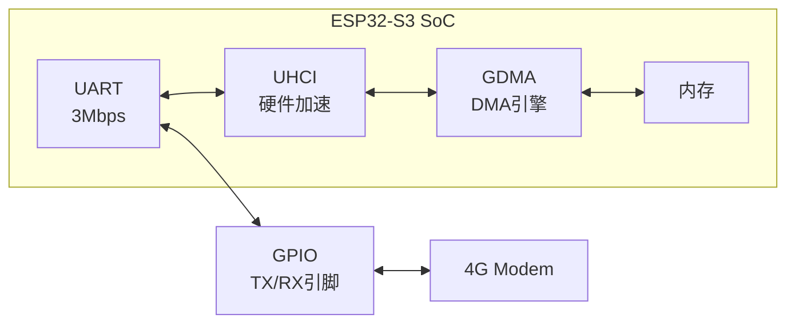
```mermaid
graph LR
    subgraph "ESP32-S3 SoC"
        UART[UART<br/>3Mbps]
        UHCI[UHCI<br/>硬件加速]
        GDMA[GDMA<br/>DMA引擎]
        MEM[内存]
    end
    
    GPIO[GPIO<br/>TX/RX引脚]
    MODEM[4G Modem]
    
    UART <--> UHCI
    UHCI <--> GDMA
    GDMA <--> MEM
    UART <--> GPIO
    GPIO <--> MODEM
```

### 3.2 RX DMA 缓冲区池模式

采用预分配的缓冲区池，实现持续接收，避免频繁的内存分配。

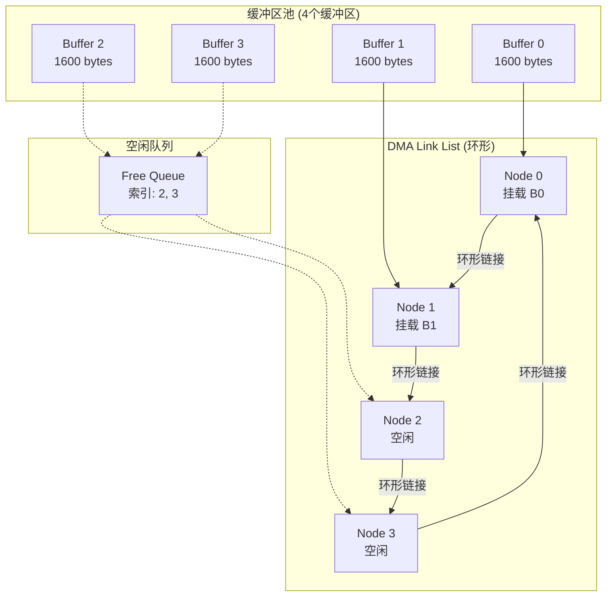
```mermaid
graph TB
    subgraph "缓冲区池 (4个缓冲区)"
        B0[Buffer 0<br/>1600 bytes]
        B1[Buffer 1<br/>1600 bytes]
        B2[Buffer 2<br/>1600 bytes]
        B3[Buffer 3<br/>1600 bytes]
    end
    
    subgraph "DMA Link List (环形)"
        N0[Node 0<br/>挂载 B0]
        N1[Node 1<br/>挂载 B1]
        N2[Node 2<br/>空闲]
        N3[Node 3<br/>空闲]
    end
    
    subgraph "空闲队列"
        FQ[Free Queue<br/>索引: 2, 3]
    end
    
    B0 --> N0
    B1 --> N1
    B2 -.-> FQ
    B3 -.-> FQ
    FQ -.-> N2
    FQ -.-> N3
    
    N0 -->|环形链接| N1
    N1 -->|环形链接| N2
    N2 -->|环形链接| N3
    N3 -->|环形链接| N0
```

**工作流程**:

1. **初始化**: 分配 4 个缓冲区，挂载 2 个到 DMA 节点，其余放入空闲队列
2. **接收**: 
   - DMA 将数据写入当前节点缓冲区
   - UART 空闲时触发 `recv_done` 回调
   - 将完成的缓冲区通过回调传递给上层
   - 从空闲队列取新缓冲区挂载到该节点
3. **归还**: 上层处理完毕后调用 `ReturnBuffer()` 将缓冲区放回空闲队列

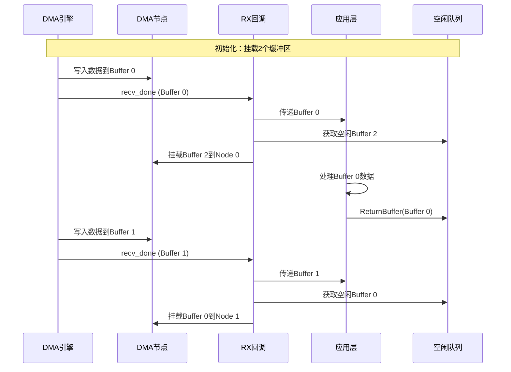
```mermaid
sequenceDiagram
    participant DMA as DMA引擎
    participant NODE as DMA节点
    participant CALLBACK as RX回调
    participant APP as 应用层
    participant FREEQ as 空闲队列
    
    Note over DMA,FREEQ: 初始化：挂载2个缓冲区
    
    DMA->>NODE: 写入数据到Buffer 0
    DMA->>CALLBACK: recv_done (Buffer 0)
    CALLBACK->>APP: 传递Buffer 0
    CALLBACK->>FREEQ: 获取空闲Buffer 2
    CALLBACK->>NODE: 挂载Buffer 2到Node 0
    
    APP->>APP: 处理Buffer 0数据
    APP->>FREEQ: ReturnBuffer(Buffer 0)
    
    DMA->>NODE: 写入数据到Buffer 1
    DMA->>CALLBACK: recv_done (Buffer 1)
    CALLBACK->>APP: 传递Buffer 1
    CALLBACK->>FREEQ: 获取空闲Buffer 0
    CALLBACK->>NODE: 挂载Buffer 0到Node 1
```

### 3.3 TX DMA 机制

TX 采用事务队列模式，支持非阻塞发送。

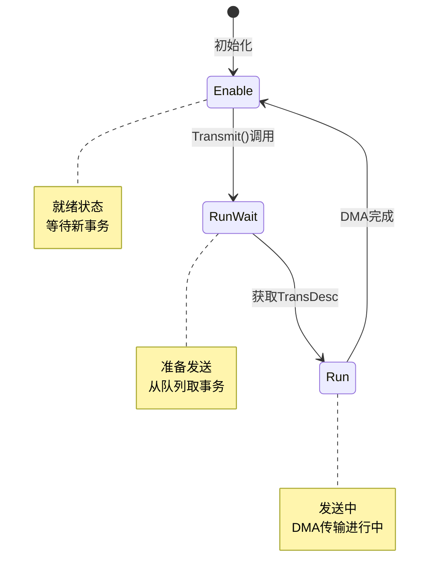
```mermaid
stateDiagram-v2
    [*] --> Enable: 初始化
    
    Enable --> RunWait: Transmit()调用
    RunWait --> Run: 获取TransDesc
    Run --> Enable: DMA完成
    
    note right of Enable
        就绪状态
        等待新事务
    end note
    
    note right of RunWait
        准备发送
        从队列取事务
    end note
    
    note right of Run
        发送中
        DMA传输进行中
    end note
```

**TX 流程**:

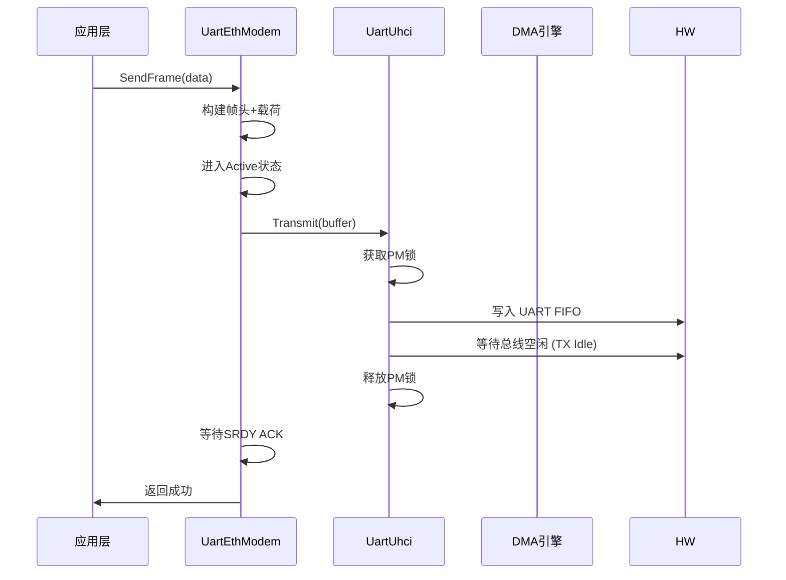
```mermaid
sequenceDiagram
    participant APP as 应用层
    participant MODEM as UartEthModem
    participant UHCI as UartUhci
    participant DMA as DMA引擎
    
    APP->>MODEM: SendFrame(data)
    MODEM->>MODEM: 构建帧头+载荷
    MODEM->>MODEM: 进入Active状态
    MODEM->>UHCI: Transmit(buffer)
    
    UHCI->>UHCI: 获取PM锁
    UHCI->>HW: 写入 UART FIFO
    UHCI->>HW: 等待总线空闲 (TX Idle)
    UHCI->>UHCI: 释放PM锁
    
    MODEM->>MODEM: 等待SRDY ACK
    MODEM->>APP: 返回成功
```

### 3.4 PM 锁管理

PM 锁用于防止系统在 DMA 传输期间进入 Light Sleep。

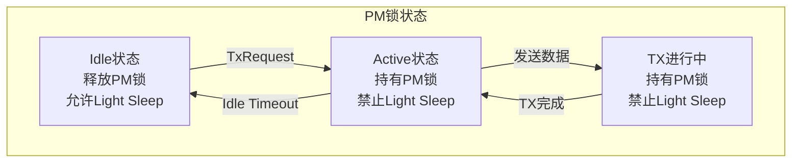
```mermaid
graph TB
    subgraph "PM锁状态"
        IDLE[Idle状态<br/>释放PM锁<br/>允许Light Sleep]
        ACTIVE[Active状态<br/>持有PM锁<br/>禁止Light Sleep]
        TX[TX进行中<br/>持有PM锁<br/>禁止Light Sleep]
    end
    
    IDLE -->|TxRequest| ACTIVE
    ACTIVE -->|Idle Timeout| IDLE
    ACTIVE -->|发送数据| TX
    TX -->|TX完成| ACTIVE
```

**PM 锁获取/释放时机**:

| 操作 | PM锁操作 | 位置 |
|------|---------|------|
| Transmit() | 获取/释放 | UartUhci::Transmit() |
| StartReceive() | 获取 | UartUhci::StartReceive() |
| StopReceive() | 释放 | UartUhci::StopReceive() |

---

## 4. 帧协议格式

### 4.1 帧头结构 (4 字节)

```
┌────────────────────────────────────────────────────────────────┐
│ Byte 0         │ Byte 1           │ Byte 2          │ Byte 3  │
├────────────────┼──────────────────┼─────────────────┼─────────┤
│ payload_len    │ seq_no   │ len   │ rsv  │type│cont│fc│ chksum│
│ [7:0]          │ [7:4]    │[11:8] │ [7:4]│[3:2]│[1] │[0]│       │
└────────────────┴──────────────────┴─────────────────┴─────────┘
```

**字段说明**:

- `payload_length [11:0]`: 载荷长度 (最大 4095 字节)
- `seq_no [3:0]`: 序列号 (0-15 循环)
- `type [1:0]`: 帧类型
  - `0`: Ethernet 帧
  - `1`: AT 命令/响应
- `continue [1]`: 分片标志
- `flow_control [0]`: 流控
  - `0`: XON (允许发送)
  - `1`: XOFF (禁止发送)
- `checksum`: 校验和 = `((raw[0]+raw[1]+raw[2]) >> 8) ^ (raw[0]+raw[1]+raw[2]) ^ 0x03`

### 4.2 完整帧结构

```
┌──────────────────────────────────────────────────────┐
│     帧头 (4 字节)     │         载荷数据              │
├──────────────────────┼───────────────────────────────┤
│   FrameHeader        │   Ethernet Frame / AT Cmd    │
│   (4 bytes)          │   (0 - 1596 bytes)           │
└──────────────────────┴───────────────────────────────┘

最大帧大小: kMaxFrameSize = 1600 字节
```

### 4.3 帧类型

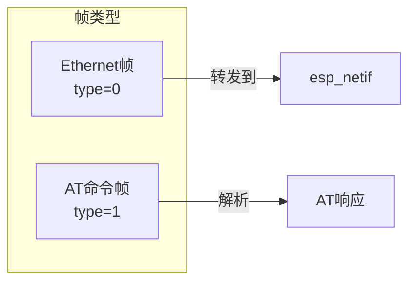
```mermaid
graph LR
    subgraph "帧类型"
        ETH[Ethernet帧<br/>type=0]
        AT[AT命令帧<br/>type=1]
    end
    
    ETH -->|转发到| NETIF[esp_netif]
    AT -->|解析| RESP[AT响应]
```

---

## 5. 事件处理机制

### 5.1 事件类型

```cpp
enum class EventType : uint8_t {
    None = 0,
    TxRequest,    // Master 请求发送数据
    SrdyLow,      // Slave 信号变低 (有数据或响应唤醒)
    SrdyHigh,     // Slave 信号变高 (ACK 或进入睡眠)
    RxData,        // 收到 DMA 数据
    Stop,          // 停止请求
};
```

### 5.2 MainTask 事件循环

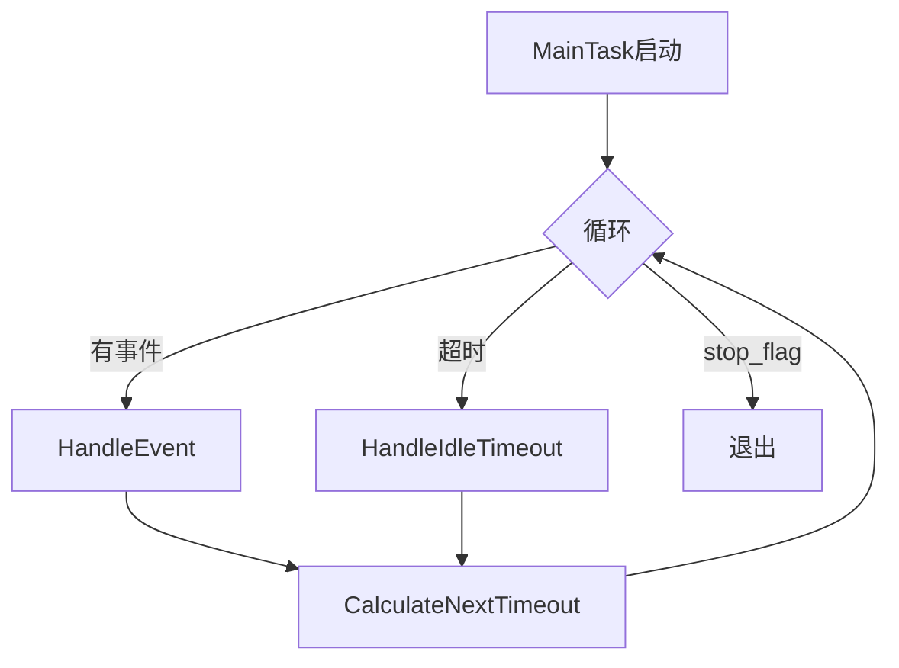
```mermaid
graph TB
    START[MainTask启动] --> LOOP{循环}
    LOOP -->|有事件| HANDLE[HandleEvent]
    LOOP -->|超时| TIMEOUT[HandleIdleTimeout]
    HANDLE --> CALC[CalculateNextTimeout]
    TIMEOUT --> CALC
    CALC --> LOOP
    LOOP -->|stop_flag| EXIT[退出]
```

**事件处理流程**:

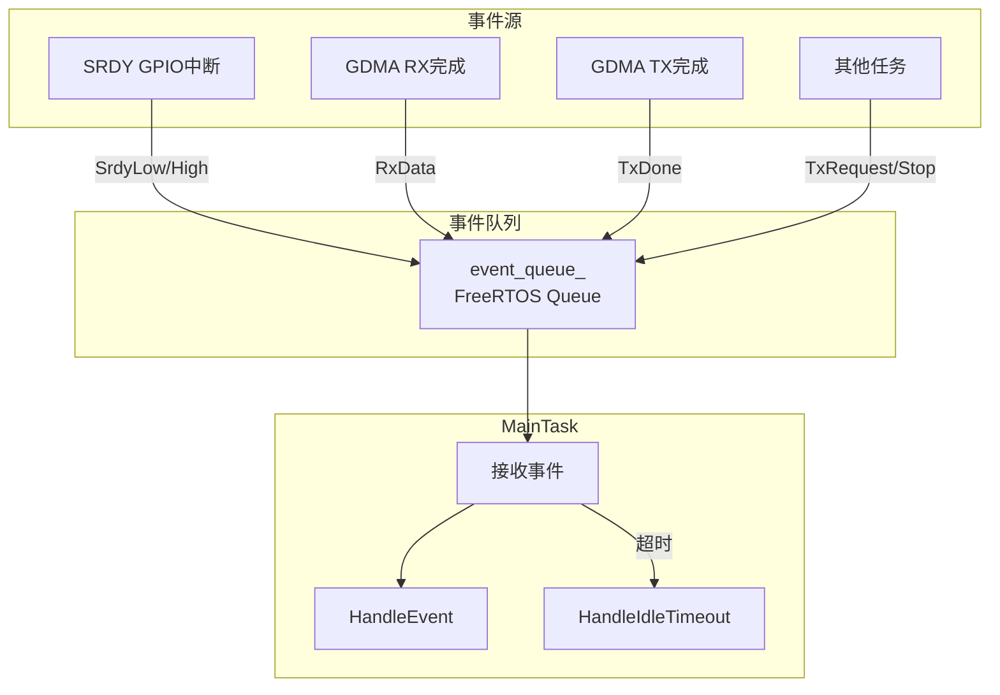
```mermaid
graph TB
    subgraph "事件源"
        ISR1[SRDY GPIO中断]
        ISR2[GDMA RX完成]
        ISR3[GDMA TX完成]
        TASK[其他任务]
    end
    
    subgraph "事件队列"
        QUEUE[event_queue_<br/>FreeRTOS Queue]
    end
    
    subgraph "MainTask"
        RECV[接收事件]
        HANDLE[HandleEvent]
        TIMEOUT[HandleIdleTimeout]
    end
    
    ISR1 -->|SrdyLow/High| QUEUE
    ISR2 -->|RxData| QUEUE
    ISR3 -->|TxDone| QUEUE
    TASK -->|TxRequest/Stop| QUEUE
    
    QUEUE --> RECV
    RECV --> HANDLE
    RECV -->|超时| TIMEOUT
```

### 5.3 中断处理

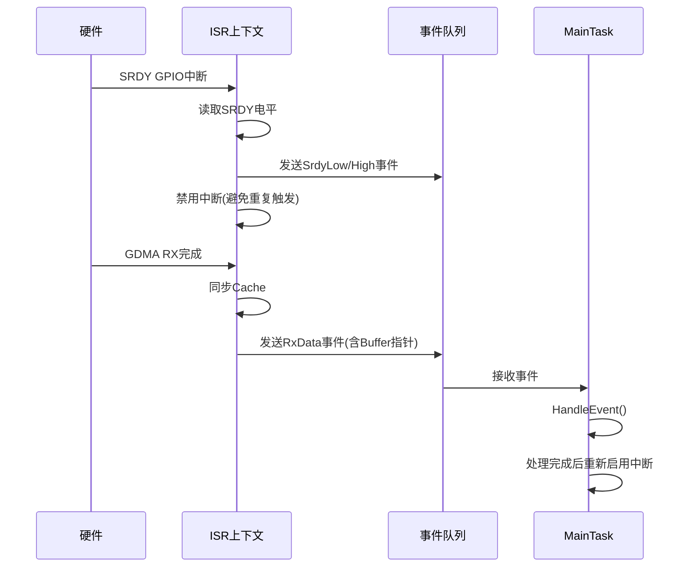
```mermaid
sequenceDiagram
    participant HW as 硬件
    participant ISR as ISR上下文
    participant QUEUE as 事件队列
    participant TASK as MainTask
    
    HW->>ISR: SRDY GPIO中断
    ISR->>ISR: 读取SRDY电平
    ISR->>QUEUE: 发送SrdyLow/High事件
    ISR->>ISR: 禁用中断(避免重复触发)
    
    HW->>ISR: GDMA RX完成
    ISR->>ISR: 同步Cache
    ISR->>QUEUE: 发送RxData事件(含Buffer指针)
    
    QUEUE->>TASK: 接收事件
    TASK->>TASK: HandleEvent()
    TASK->>TASK: 处理完成后重新启用中断
```

---

## 6. 初始化流程

### 6.1 完整启动序列

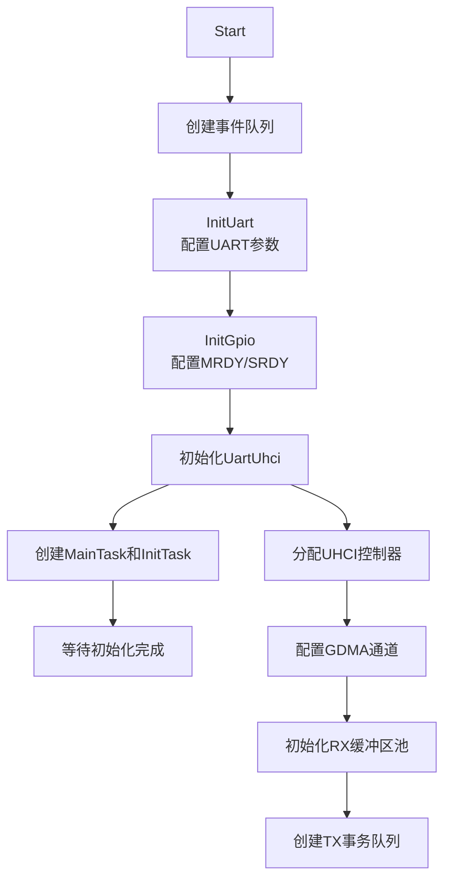
```mermaid
graph TB
    START[Start] --> CREATEQ[创建事件队列]
    CREATEQ --> INITUART[InitUart<br/>配置UART参数]
    INITUART --> INITGPIO[InitGpio<br/>配置MRDY/SRDY]
    INITGPIO --> INITUHCI[初始化UartUhci]
    INITUHCI --> CREATETASK[创建MainTask和InitTask]
    CREATETASK --> WAIT[等待初始化完成]
    
    INITUHCI --> ALLOC[分配UHCI控制器]
    ALLOC --> CONFIG[配置GDMA通道]
    CONFIG --> POOL[初始化RX缓冲区池]
    POOL --> QUEUE[创建TX事务队列]
```

### 6.2 InitTask 初始化序列

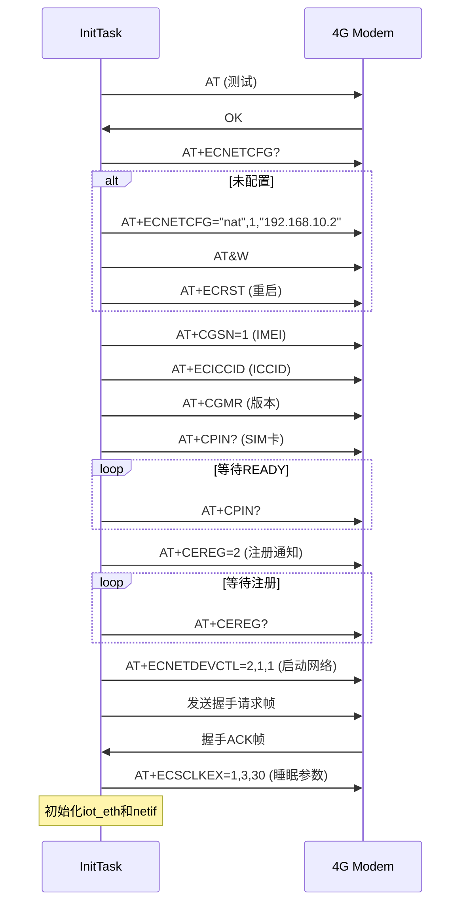
```mermaid
sequenceDiagram
    participant INIT as InitTask
    participant MODEM as 4G Modem
    
    INIT->>MODEM: AT (测试)
    MODEM->>INIT: OK
    
    INIT->>MODEM: AT+ECNETCFG?
    alt 未配置
        INIT->>MODEM: AT+ECNETCFG="nat",1,"192.168.10.2"
        INIT->>MODEM: AT&W
        INIT->>MODEM: AT+ECRST (重启)
    end
    
    INIT->>MODEM: AT+CGSN=1 (IMEI)
    INIT->>MODEM: AT+ECICCID (ICCID)
    INIT->>MODEM: AT+CGMR (版本)
    
    INIT->>MODEM: AT+CPIN? (SIM卡)
    loop 等待READY
        INIT->>MODEM: AT+CPIN?
    end
    
    INIT->>MODEM: AT+CEREG=2 (注册通知)
    loop 等待注册
        INIT->>MODEM: AT+CEREG?
    end
    
    INIT->>MODEM: AT+ECNETDEVCTL=2,1,1 (启动网络)
    INIT->>MODEM: 发送握手请求帧
    MODEM->>INIT: 握手ACK帧
    
    INIT->>MODEM: AT+ECSCLKEX=1,3,30 (睡眠参数)
    
    Note over INIT: 初始化iot_eth和netif
```

---

## 7. 数据流

### 7.1 发送数据流

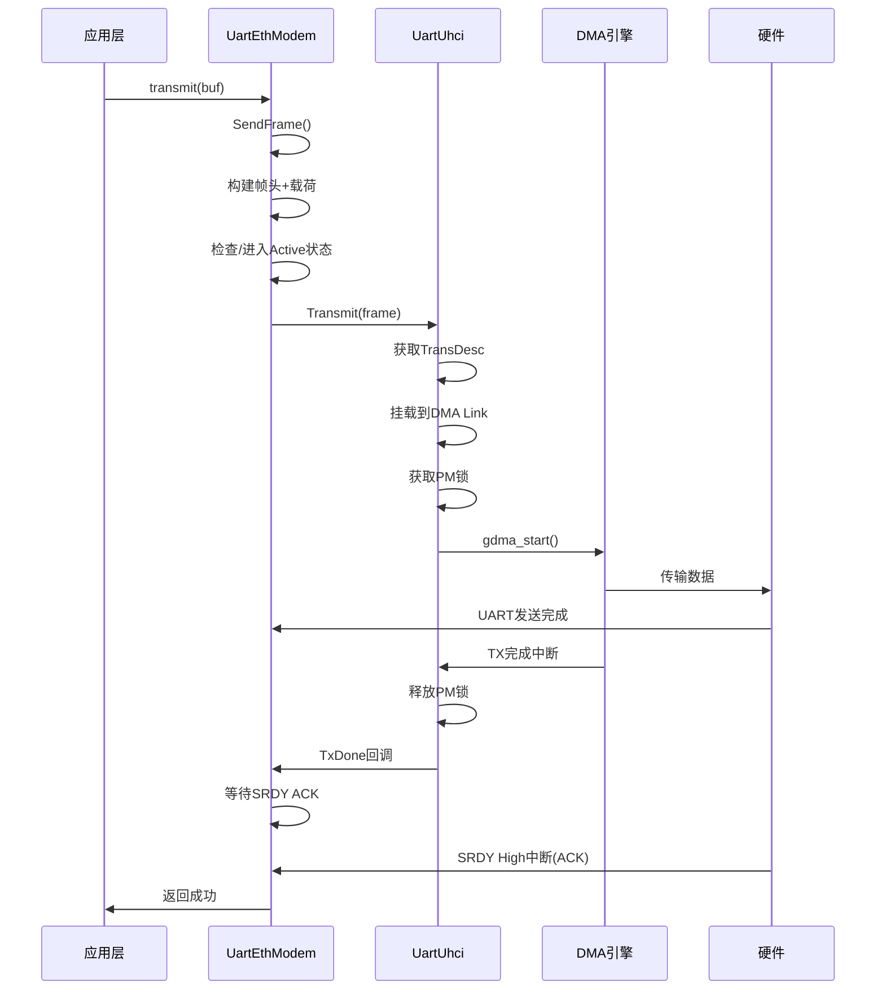
```mermaid
sequenceDiagram
    participant APP as 应用层
    participant MODEM as UartEthModem
    participant UHCI as UartUhci
    participant DMA as DMA引擎
    participant HW as 硬件
    
    APP->>MODEM: transmit(buf)
    MODEM->>MODEM: SendFrame()
    MODEM->>MODEM: 构建帧头+载荷
    MODEM->>MODEM: 检查/进入Active状态
    
    MODEM->>UHCI: Transmit(frame)
    UHCI->>UHCI: 获取TransDesc
    UHCI->>UHCI: 挂载到DMA Link
    UHCI->>UHCI: 获取PM锁
    UHCI->>DMA: gdma_start()
    
    DMA->>HW: 传输数据
    HW->>MODEM: UART发送完成
    
    DMA->>UHCI: TX完成中断
    UHCI->>UHCI: 释放PM锁
    UHCI->>MODEM: TxDone回调
    
    MODEM->>MODEM: 等待SRDY ACK
    HW->>MODEM: SRDY High中断(ACK)
    MODEM->>APP: 返回成功
```

### 7.2 接收数据流

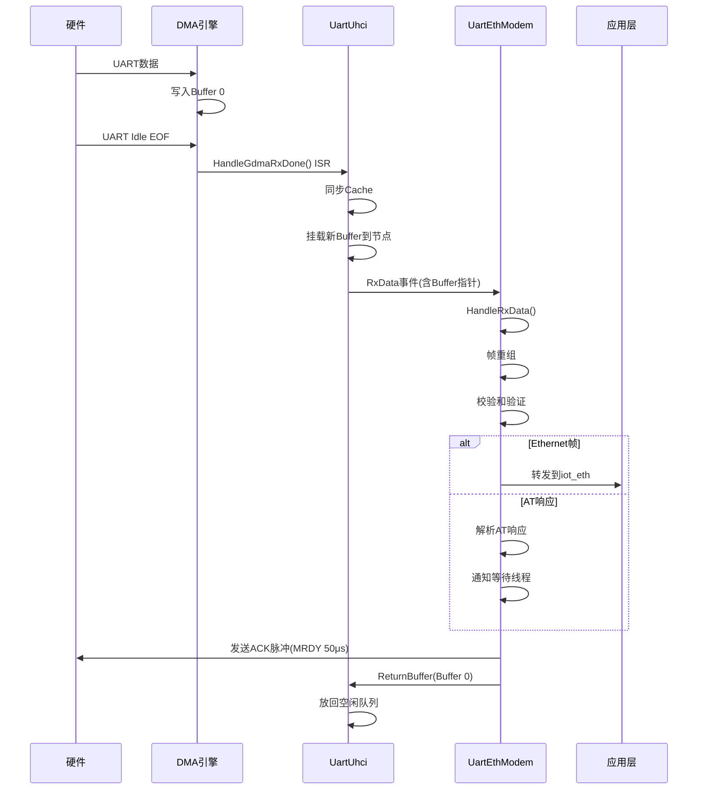
```mermaid
sequenceDiagram
    participant HW as 硬件
    participant DMA as DMA引擎
    participant UHCI as UartUhci
    participant MODEM as UartEthModem
    participant APP as 应用层
    
    HW->>DMA: UART数据
    DMA->>DMA: 写入Buffer 0
    HW->>DMA: UART Idle EOF
    
    DMA->>UHCI: HandleGdmaRxDone() ISR
    UHCI->>UHCI: 同步Cache
    UHCI->>UHCI: 挂载新Buffer到节点
    UHCI->>MODEM: RxData事件(含Buffer指针)
    
    MODEM->>MODEM: HandleRxData()
    MODEM->>MODEM: 帧重组
    MODEM->>MODEM: 校验和验证
    
    alt Ethernet帧
        MODEM->>APP: 转发到iot_eth
    else AT响应
        MODEM->>MODEM: 解析AT响应
        MODEM->>MODEM: 通知等待线程
    end
    
    MODEM->>HW: 发送ACK脉冲(MRDY 50μs)
    MODEM->>UHCI: ReturnBuffer(Buffer 0)
    UHCI->>UHCI: 放回空闲队列
```

---

## 8. 低功耗管理

### 8.1 睡眠唤醒流程

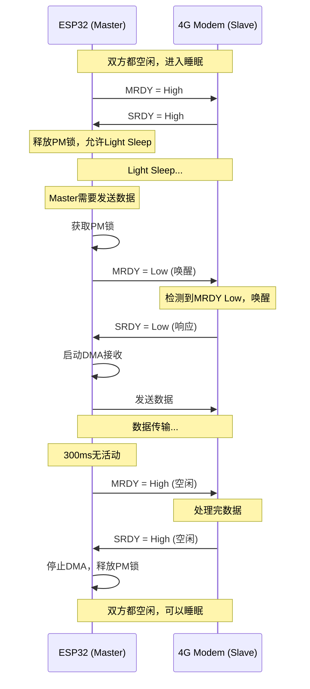
```mermaid
sequenceDiagram
    participant ESP32 as ESP32 (Master)
    participant MODEM as 4G Modem (Slave)
    
    Note over ESP32,MODEM: 双方都空闲，进入睡眠
    
    ESP32->>MODEM: MRDY = High
    MODEM->>ESP32: SRDY = High
    
    Note over ESP32: 释放PM锁，允许Light Sleep
    
    Note over ESP32,MODEM: Light Sleep...
    
    Note over ESP32: Master需要发送数据
    
    ESP32->>ESP32: 获取PM锁
    ESP32->>MODEM: MRDY = Low (唤醒)
    
    Note over MODEM: 检测到MRDY Low，唤醒
    
    MODEM->>ESP32: SRDY = Low (响应)
    
    ESP32->>ESP32: 启动DMA接收
    ESP32->>MODEM: 发送数据
    
    Note over ESP32,MODEM: 数据传输...
    
    Note over ESP32: 300ms无活动
    
    ESP32->>MODEM: MRDY = High (空闲)
    
    Note over MODEM: 处理完数据
    
    MODEM->>ESP32: SRDY = High (空闲)
    
    ESP32->>ESP32: 停止DMA，释放PM锁
    
    Note over ESP32,MODEM: 双方都空闲，可以睡眠
```

### 8.2 低功耗状态转换

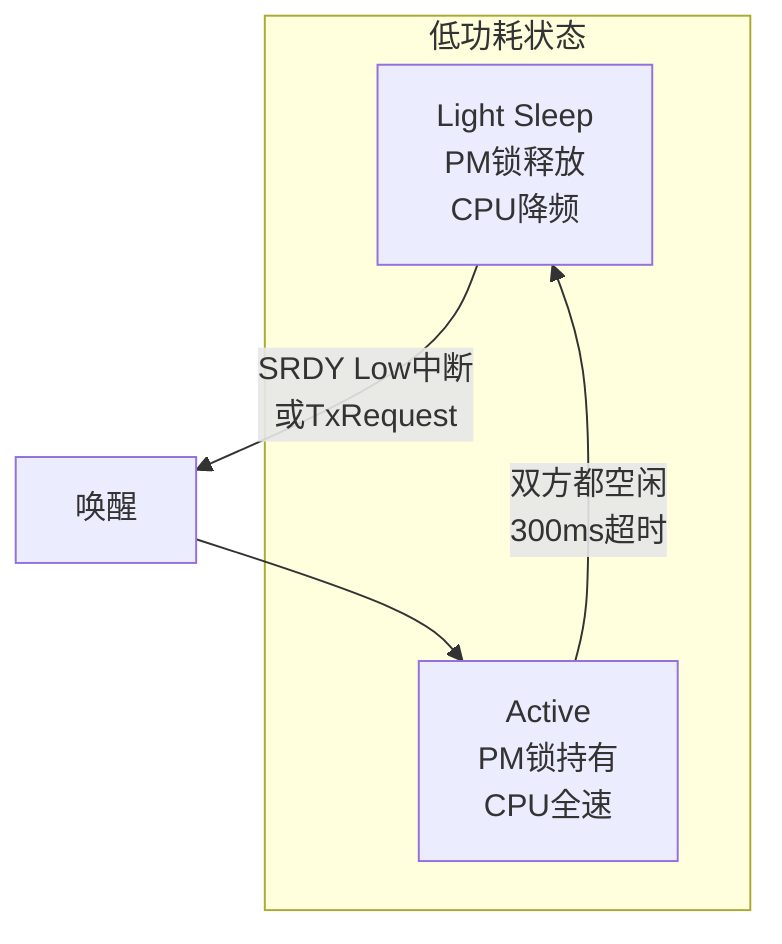
```mermaid
graph TB
    subgraph "低功耗状态"
        SLEEP[Light Sleep<br/>PM锁释放<br/>CPU降频]
        ACTIVE[Active<br/>PM锁持有<br/>CPU全速]
    end
    
    SLEEP -->|SRDY Low中断<br/>或TxRequest| WAKE[唤醒]
    WAKE --> ACTIVE
    ACTIVE -->|双方都空闲<br/>300ms超时| SLEEP
```

---

## 9. 帧重组机制

当一个完整帧分布在多个 DMA 缓冲区时，需要进行帧重组。

```mermaid
stateDiagram-v2
    [*] --> 等待帧头: 初始化
    
    等待帧头 --> 收集帧头: 数据 < 4字节
    等待帧头 --> 解析帧头: 数据 >= 4字节
    
    收集帧头 --> 解析帧头: 收集到4字节
    
    解析帧头 --> 完整帧: 数据 >= frame_size
    解析帧头 --> 收集载荷: 数据 < frame_size
    
    收集载荷 --> 完整帧: 收集到frame_size
    收集载荷 --> 收集载荷: 继续收集
    
    完整帧 --> 处理帧: ProcessReceivedFrame
    处理帧 --> 发送ACK: SendAckPulse
    发送ACK --> [*]: 重置状态
```

**重组状态**:

```cpp
uint8_t* reassembly_buffer_;      // 重组缓冲区 (1600 字节)
size_t reassembly_size_;          // 当前已收集的字节数
size_t reassembly_expected_;      // 期望的完整帧大小
```

**重组流程示例**:

```
Buffer 1: [帧头前2字节] [帧头后2字节] [载荷前100字节]
          └─收集到重组缓冲区─┘
          
Buffer 2: [载荷中100字节] [载荷后50字节]
          └─继续收集─┘
          
重组完成: [完整帧头] [完整载荷]
          └─处理帧─┘
```

---

## 10. 错误处理

### 10.1 常见错误场景

| 错误类型 | 检测方式 | 处理策略 |
|---------|---------|---------|
| **帧校验失败** | checksum 不匹配 | 丢弃帧，继续接收 |
| **帧过大** | length > 1600 | 丢弃帧，重置重组状态 |
| **Slave 无响应** | PendingActive 超时 | 强制进入 Active，发送可能失败 |
| **TX 超时** | 等待 TxDone 超时 | 返回错误，释放资源 |
| **ACK 超时** | 等待 SRDY High 超时 | 返回错误，继续运行 |
| **缓冲区耗尽** | 无空闲缓冲区 | 记录警告，可能丢失数据 |

### 10.2 错误恢复流程

```mermaid
graph TB
    ERROR[检测到错误] --> TYPE{错误类型}
    
    TYPE -->|校验失败| DISCARD[丢弃帧]
    TYPE -->|超时| RETRY[重试/超时返回]
    TYPE -->|缓冲区耗尽| WARN[记录警告]
    TYPE -->|严重错误| RESET[重置状态]
    
    DISCARD --> CONTINUE[继续运行]
    RETRY --> CONTINUE
    WARN --> CONTINUE
    RESET --> CONTINUE
```

### 10.3 资源清理

```mermaid
graph TB
    STOP[Stop调用] --> FLAG[设置stop_flag]
    FLAG --> WAIT[等待任务退出]
    WAIT --> CLEANUP[CleanupResources]
    
    CLEANUP --> ETH[DeinitIotEth]
    ETH --> UHCI[uart_uhci_.Deinit]
    UHCI --> BUFFER[释放重组缓冲区]
    BUFFER --> SEM[删除信号量]
    SEM --> QUEUE[清空事件队列]
    QUEUE --> GPIO[DeinitGpio]
    GPIO --> UART[DeinitUart]
    UART --> DONE[完成]
```

---

## 11. 关键配置参数

```cpp
// 帧大小
static constexpr size_t kMaxFrameSize = 1600;

// RX 缓冲区池
static constexpr size_t kRxBufferCount = 4;
static constexpr size_t kRxBufferSize = 1600;

// 超时参数
static constexpr int64_t kIdleTimeoutMs = 300;   // 300ms 空闲超时
static constexpr int64_t kAckTimeoutMs = 100;     // 100ms ACK 超时
static constexpr int64_t kAckPulseUs = 50;              // 50μs ACK 脉冲

// UART 配置
baud_rate = 3000000;  // 3Mbps
data_bits = 8;
parity = none;
stop_bits = 1;
```

---

## 12. 线程安全

### 12.1 同步机制

| 资源 | 保护机制 | 说明 |
|------|---------|------|
| **AT 命令发送** | `at_mutex_` (std::mutex) | 串行化 AT 命令 |
| **帧发送** | `send_mutex_` (std::mutex) | 串行化帧发送 |
| **状态标志** | `std::atomic<T>` | 原子操作 |
| **事件通知** | `event_group_` (EventGroup) | 事件同步 |
| **AT 响应等待** | `at_command_response_semaphore_` | 信号量同步 |
| **DMA 缓冲区队列** | FreeRTOS Queue (ISR safe) | ISR 安全队列 |

### 12.2 线程模型

```mermaid
graph TB
    subgraph "任务和线程"
        MAIN[MainTask<br/>事件处理]
        INIT[InitTask<br/>初始化]
        APP[应用线程<br/>调用API]
    end
    
    subgraph "ISR上下文"
        SRDY[SRDY GPIO ISR]
        GDMA_RX[GDMA RX ISR]
    end
    
    SRDY -->|发送事件| QUEUE[事件队列]
    GDMA_RX -->|发送事件| QUEUE
    
    QUEUE --> MAIN
    APP -->|互斥锁| MAIN
    INIT -->|事件组| MAIN
```

---

## 13. 性能优化

### 13.1 DMA 缓冲区池优势

- **零拷贝**: DMA 直接写入预分配缓冲区
- **持续接收**: 无需等待处理完成即可继续接收
- **低延迟**: 减少内存分配开销

### 13.2 状态机优化

- **快速唤醒**: PendingActive 状态避免不必要的等待
- **智能超时**: 根据状态动态计算超时时间
- **PM 锁管理**: 仅在需要时持有，减少功耗

---

## 14. 调试建议

### 14.1 启用调试日志

```cpp
modem.SetDebug(true);
```

### 14.2 关键日志点

- 状态转换: `EnterActiveState()`, `EnterIdleState()`
- 帧处理: `ProcessReceivedFrame()`, `SendFrame()`
- DMA 事件: `HandleGdmaRxDone()`, `HandleGdmaTxDone()`
- 错误处理: 校验失败、超时等

### 14.3 常见问题排查

1. **Slave 无响应**: 检查 MRDY/SRDY 连接
2. **帧丢失**: 检查缓冲区池大小和归还时机
3. **超时错误**: 检查 UART 波特率和信号质量
4. **PM 锁问题**: 检查 DMA 启停时机

---

**文档版本**: 1.0  
**最后更新**: 2025-01-06  
**适用模块**: EC801E, NT26K 等支持 UART NAT 模式的 4G 模块

